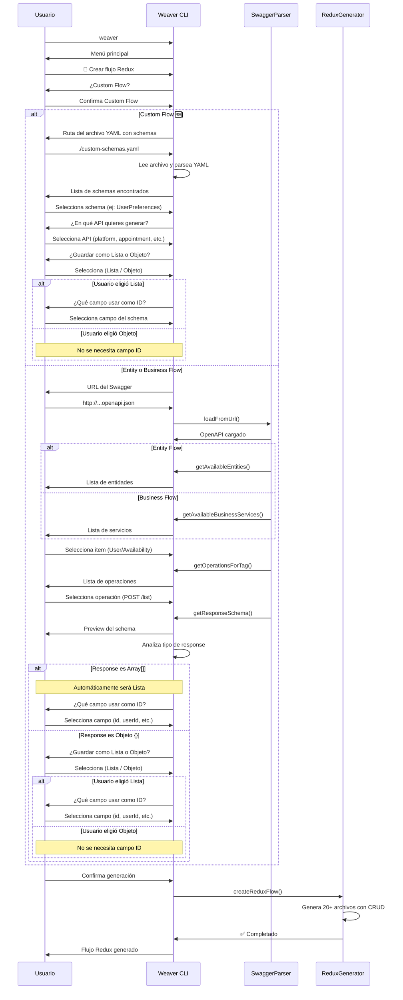
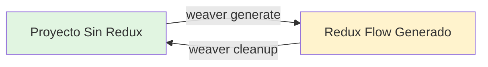

# 🔴 Redux Flow Generator - Especificación Completa

**Versión**: 3.1.0  
**Fecha**: Noviembre 2024  
**Autor**: Weaver CLI Team

---

## 📊 Estado Actual de Implementación

**Última Actualización**: 1 de Noviembre 2024

| Fase | Estado | Progreso | Descripción |
|------|--------|----------|-------------|
| **Fase 1** | ✅ COMPLETADA | 100% | Parser Extensions - Nuevos métodos en swagger-parser.ts |
| **Fase 2** | ✅ COMPLETADA | 100% | Redux Generator - Archivo redux-flow-generator.ts |
| **Fase 3** | ✅ COMPLETADA | 100% | Templates - Funciones de generación restantes |
| **Fase 4** | ✅ COMPLETADA | 100% | CLI Integration - Integrar con cli.ts |
| **Fase 5** | ⏳ PENDIENTE | 0% | Testing - Tests unitarios e integración |
| **Fase 6** | ⏳ PENDIENTE | 0% | Documentation - Actualizar README y docs |

### ✅ Completado (Fase 1 - Parser Extensions):
- ✅ **Creado nuevo parser especializado**: `swagger-redux-parser.ts` 🆕
- ✅ Parser original `swagger-parser.ts` intacto para Entity/Business flows
- ✅ Interfaces `Operation` y `ResponseSchema`
- ✅ Método `getOperationsForTag(tagName)` 
- ✅ Método `getResponseTypeSummary(path, method)`
- ✅ Método `getResponseSchema(path, method)`
- ✅ Método `loadFromFile(filePath)` para Custom Flow
- ✅ Método `getAvailableSchemasFromFile()`
- ✅ Método `getSchemaByName(schemaName)`
- ✅ **MEJORA**: Extracción automática del campo `response` en schemas wrapper 🆕

### ✅ Completado (Fase 2 - Redux Generator - 100%):
- ✅ Estructura base del generador
- ✅ Función principal `createReduxFlow()`
- ✅ Generación de Core Files (interfaces, types)
- ✅ **Generación de DTOs Redux con interfaces recursivas** 🆕
  - ✅ Generación recursiva de interfaces para objetos anidados
  - ✅ Todas las interfaces con sufijo `ReduxDTO`
  - ✅ Preservación de nombres de campos en camelCase original
- ✅ Generación de Repository Interfaces (con nivel `custom/`)
- ✅ **Generación completa de Use Cases:**
  - ✅ 5 Use Cases para Arrays (create, read, update, delete, clear)
  - ✅ 5 Use Cases para Objetos (save, read, readProperty, update, clear)
  - ✅ Archivos de injection de use cases
- ✅ **Generación de Facade** (con métodos para arrays y objetos)
- ✅ **Generación de Slice** (state, reducers, actions)
  - ✅ Detección de imports multilínea para actualización correcta 🆕
  - ✅ Preservación de imports existentes al agregar nuevos flujos 🆕
- ✅ **Generación de Reducers** (archivos individuales por tipo)
- ✅ **Generación de Repository Implementation** (con actualización incremental)
- ✅ **Archivos de Injection** (para use cases, facade, repository)
- ✅ **Registro en redux-core.ts** (automático en primera generación)

### ✅ Completado (Fase 3 - Templates - 100%):
- ✅ Todas las funciones de generación implementadas
- ✅ String replacement para actualización incremental
- ✅ Soporte para arrays y objetos
- ✅ Método genérico `readProperty` para objetos

### ✅ Completado (Fase 4 - CLI Integration - 100%):
- ✅ Opción "🔴 Crear flujo Redux" en el menú principal
- ✅ Función `handleCreateReduxFlow()` completa
- ✅ Flujo interactivo completo:
  - ✅ Selección de tipo (Entity/Business)
  - ✅ Carga de Swagger desde URL
  - ✅ Detección automática de API
  - ✅ Selección de operación con preview
  - ✅ Decisión de storage (Array/Objeto)
  - ✅ Selección de campo ID (para arrays)
  - ✅ Configuración de directorio target
  - ✅ Resumen y confirmación
  - ✅ Generación completa del flujo Redux

### 🆕 Mejoras Recientes Implementadas (Noviembre 1, 2024):

#### 1. **Conversión Automática snake_case → camelCase** 🔄 ⭐ NUEVO
- **Los campos del YAML en snake_case se convierten automáticamente a camelCase**
- Aplica tanto a campos principales como a objetos anidados recursivamente
- Función `toCamelCase()` aplicada a todos los campos en generación de DTOs
- Ejemplo:
  ```yaml
  # YAML (snake_case)
  properties:
    first_name: string
    last_name: string
    main_location: boolean
    token_expiration_minutes: integer
  ```
  
  ```typescript
  // TypeScript generado (camelCase)
  export interface IUserReduxDTO {
    firstName?: string;           // ✅ Convertido
    lastName?: string;            // ✅ Convertido
    mainLocation?: boolean;       // ✅ Convertido
    tokenExpirationMinutes?: number;  // ✅ Convertido
  }
  ```

#### 2. **Rutas de Importación Corregidas** 📦 ⭐ NUEVO
- **Corregida la ruta del archivo de inyección global**
- Eliminado nivel redundante `{api}/` en la ruta
- Cambio aplicado a todos los Use Cases:
  ```typescript
  // ❌ ANTES (incorrecto - nivel extra)
  import { InjectionRepositoriesRedux } from "@platform/infrastructure/repositories/redux/platform/injection";
  
  // ✅ AHORA (correcto)
  import { InjectionRepositoriesRedux } from "@platform/infrastructure/repositories/redux/injection";
  ```

#### 3. **Inyección Global Inteligente** 🔧 ⭐ NUEVO
- **Ya no se crean archivos de inyección locales por flow**
- **Actualiza automáticamente el archivo de inyección global**
- Ubicación: `infrastructure/repositories/redux/injection/injection-repositories-redux.ts`
- Agrega imports y métodos estáticos incrementalmente
- Detecta métodos existentes para evitar duplicados
- Ejemplo de actualización:
  ```typescript
  // Antes de generar nuevo flow
  import { PlatformReduxRepository } from "../bus/platform/platform-redux-repository";
  
  export class InjectionRepositoriesRedux {
      public static PlatformReduxRepository() { 
          return PlatformReduxRepository.getInstance() 
      }
  }
  
  // Después de generar "platform-configuration" flow
  import { PlatformReduxRepository } from "../bus/platform/platform-redux-repository";
  import { PlatformConfigurationReduxRepository } from "../platform/custom/platform-configuration/platform-configuration-redux-repository"; // ✅ Agregado
  
  export class InjectionRepositoriesRedux {
      public static PlatformReduxRepository() { 
          return PlatformReduxRepository.getInstance() 
      }
      
      public static PlatformConfigurationReduxRepository() {  // ✅ Agregado
          return PlatformConfigurationReduxRepository.getInstance() 
      }
  }
  ```

#### 4. **Nombres de Repositorio Específicos en Use Cases** 🎯 ⭐ NUEVO
- **Use Cases ahora usan el repositorio específico del flow**
- Antes usaban el repositorio genérico del API
- Mejora la claridad y consistencia del código
- Ejemplo:
  ```typescript
  // ❌ ANTES (nombre genérico del API)
  export class SavePlatformConfigurationUseCase {
      private platformReduxRepository = InjectionRepositoriesRedux.PlatformReduxRepository();
      
      public execute(param: IPlatformConfigurationReduxDTO, config: IConfigDTO): void {
          this.platformReduxRepository.savePlatformConfiguration(param, config);
      }
  }
  
  // ✅ AHORA (nombre específico del flow)
  export class SavePlatformConfigurationUseCase {
      private platformConfigurationReduxRepository = InjectionRepositoriesRedux.PlatformConfigurationReduxRepository();
      
      public execute(param: IPlatformConfigurationReduxDTO, config: IConfigDTO): void {
          this.platformConfigurationReduxRepository.savePlatformConfiguration(param, config);
      }
  }
  ```

#### 5. **Búsqueda Mejorada de redux-core.ts** 🔍 ⭐ NUEVO
- **Busca en múltiples ubicaciones posibles**
- Funciona con diferentes estructuras de proyecto
- Ubicaciones de búsqueda:
  1. `{basePath}/core/redux/redux-core.ts` (dentro del API)
  2. `{basePath}/../core/redux/redux-core.ts` (nivel src)
  3. `{basePath}/../../core/redux/redux-core.ts` (dos niveles arriba)
- Si no encuentra ninguno, omite el registro sin error

#### 6. **Código Limpio Sin Comentarios Decorativos** ✨ ⭐ NUEVO
- **Eliminados comentarios decorativos innecesarios**
- Comentarios removidos:
  - Líneas con `====` (separadores)
  - `// Use Cases para ${flowName}`
  - `// MÉTODOS PARA ${flowName} (Array/Object)`
- **Comentarios preservados:**
  - JSDoc al inicio de clases y archivos
  - Comentarios de imports organizativos
  - Marcadores WEAVER para actualizaciones
- Código más profesional y limpio

#### 7. **Generación Recursiva de Interfaces** ⭐
- Todos los objetos anidados generan interfaces específicas con sufijo `ReduxDTO`
- Recursión infinita: objetos dentro de objetos generan sus propias interfaces
- **Incluye conversión a camelCase en todos los niveles**
- Ejemplo:
  ```typescript
  export interface IDashboardReduxDTO {
    recentActivities?: IRecentActivitiesReduxDTO[];  // ✅ Interface específica
    platformConfiguration?: IPlatformConfigurationReduxDTO;  // ✅ camelCase + ReduxDTO
  }
  
  export interface IRecentActivitiesReduxDTO {
    activityType?: string;      // ✅ snake_case convertido
    createdAt?: string;         // ✅ snake_case convertido
    userId?: string;            // ✅ snake_case convertido
  }
  ```

#### 8. **Corrección de Imports Multilínea en Slice**
- Detección correcta de bloques de imports multilínea
- Preservación de todos los imports al agregar nuevos flujos
- Pattern regex mejorado: `/import\s*\{[^}]+\}\s*from\s*["']\.\/.*\.reducer["'];?/gs`
- Evita eliminar imports de flujos anteriores

#### 9. **Estructura de Carpetas Consistente**
- Todos los flujos custom incluyen nivel `custom/` en la ruta
- Ejemplo: `redux/appointment/custom/dashboard/`
- Aplicado a todas las 3 capas: domain, facade, infrastructure

#### 10. **Correcciones Críticas en Repositorio Redux** 🔧 ⭐ NUEVO
- **Corregido**: Nombre de clase del repositorio ahora es específico del flow
  ```typescript
  // ❌ ANTES (incorrecto - nombre genérico del API)
  export class PlatformReduxRepository extends IPlatformReduxRepository {
      private static instance: PlatformReduxRepository;
  }
  
  // ✅ AHORA (correcto - nombre específico del flow)
  export class PlatformConfigurationReduxRepository extends IPlatformConfigurationReduxRepository {
      private static instance: PlatformConfigurationReduxRepository;
  }
  ```

- **Corregido**: Import de interface específica del flow
  ```typescript
  // ❌ ANTES (incorrecto - interface genérica del API)
  import { IPlatformReduxRepository } from "@platform/domain/services/repositories/redux/platform/i-platform-redux-repository";
  
  // ✅ AHORA (correcto - interface específica del flow)
  import { IPlatformConfigurationReduxRepository } from "@platform/domain/services/repositories/redux/platform/custom/i-platform-configuration-redux-repository";
  ```

- **Corregido**: Ruta relativa al slice desde el repositorio
  ```typescript
  // ❌ ANTES (incorrecto - faltaban niveles)
  import { platformSlice } from "./platform.slice";
  
  // ✅ AHORA (correcto - ruta desde custom/flow-name/ hacia nivel API)
  import { platformSlice } from "../../platform.slice";
  ```

**Impacto**: Estas correcciones resuelven errores de compilación TypeScript y aseguran que cada flow tenga su propio repositorio independiente.

### ⏳ Próximos Pasos:
1. Fase 5: Testing - Tests unitarios e integración
2. Fase 6: Documentation - Actualizar README y docs

---

## 📋 Índice

1. [Introducción](#introducción)
2. [Objetivo](#objetivo)
3. [Casos de Uso](#casos-de-uso)
4. [Flujo de Usuario](#flujo-de-usuario)
5. [Estructura de Archivos Generada](#estructura-de-archivos-generada)
6. [Custom Flow - Especificación Detallada](#custom-flow---especificación-detallada) 🆕
7. [Especificación de Archivos](#especificación-de-archivos)
8. [Parser Extensions](#parser-extensions)
9. [Generator Implementation](#generator-implementation)
10. [CLI Integration](#cli-integration)
11. [Reglas de Generación](#reglas-de-generación)
12. [Ejemplos Completos](#ejemplos-completos)
13. [Checklist de Implementación](#checklist-de-implementación)

---

## Introducción

El **Redux Flow Generator** es una nueva funcionalidad de Weaver CLI que genera automáticamente toda la estructura Redux (slice, actions, reducers, repositories, use cases, facades) basándose en:
- **Schemas de archivo YAML**: Estructuras personalizadas definidas en formato OpenAPI 3.0.x

### Contexto

El generador toma como base la arquitectura Redux implementada en `goluti-frontend` (documentada en `redux-flow-platform.md`) y la adapta para:
- **Custom Flows**: Estructuras personalizadas definidas en archivo YAML con schemas OpenAPI 3.0.x

### Arquitectura Clave

- **Un slice por API**: Cada API (platform, appointment, etc.) tiene UN solo slice que contiene todos sus custom flows
- **Modelo Flat**: Estado Redux no anidado, cada custom flow tiene su propia propiedad en el estado
- **Actualización Inteligente**: Primera generación crea el slice y lo registra en `redux-core.ts`; generaciones subsiguientes actualizan el slice existente
- **String Replacement**: Utiliza reemplazo inteligente de strings para actualizar archivos existentes

---

## Objetivo

Generar automáticamente todo el flujo Redux para guardar la respuesta de un endpoint del Swagger en el store de Redux, manteniendo:

✅ Clean Architecture con capas separadas  
✅ Patrón Repository + Use Cases + Facade  
✅ Redux Toolkit (slice, reducers, actions)  
✅ Mappers bidireccionales  
✅ Sistema de inyección de dependencias  
✅ Type Safety completo con TypeScript  

---

## Casos de Uso

### Caso 1: Entity Flow - Guardar Lista de Usuarios (CRUD sobre Array)

**Escenario**: El desarrollador tiene un endpoint `POST /api/user/list` que retorna un objeto `{ id, name, email, ... }` y **elige guardarlo como Lista** en Redux para hacer CRUD sobre múltiples usuarios.

**Input**:
```
- Tipo: Entity Flow
- Entity: User
- Operación: POST /api/user/list
- Response Schema: { id, name, email, ... } ← OBJETO
- CLI Analiza: Es un objeto → Pregunta al usuario
- Usuario elige: Lista (Array) ← DECISIÓN DEL USUARIO
- Campo ID: id (seleccionado por usuario)
```

**Operaciones CRUD Generadas**:
- `createUser()` - Agregar un usuario al array
- `readUser(id)` - Leer un usuario específico por ID
- `readAllUsers()` - Leer todo el array
- `updateUser(id, data)` - Actualizar un usuario específico
- `deleteUser(id)` - Eliminar un usuario del array
- `clearUsers()` - Limpiar todo el array

**Output**: Genera 20+ archivos con CRUD completo para manejar el array de usuarios en Redux.

**Nota**: Si el response del Swagger es un **objeto**, el usuario puede elegir guardarlo como Lista o como Objeto único.

---

### Caso 2: Business Flow - Guardar Tabla de Citas (CRUD sobre Array)

**Escenario**: El desarrollador tiene un endpoint `POST /api/appointment/business/availability/appointment-table` que retorna un objeto con datos de cita y **elige guardarlo como Lista** en Redux para gestionar múltiples citas.

**Input**:
```
- Tipo: Business Flow
- Service: Availability
- Operación: POST .../appointment-table
- Response Schema: { appointmentId, date, time, ... } ← OBJETO
- CLI Analiza: Es un objeto → Pregunta al usuario
- Usuario elige: Lista (Array) ← DECISIÓN DEL USUARIO
- Campo ID: appointmentId (seleccionado por usuario)
```

**Operaciones CRUD Generadas**:
- `createAppointment()` - Agregar una cita al array
- `readAppointment(appointmentId)` - Leer una cita específica
- `readAllAppointments()` - Leer toda la tabla
- `updateAppointment(appointmentId, data)` - Actualizar una cita
- `deleteAppointment(appointmentId)` - Eliminar una cita
- `clearAppointments()` - Limpiar toda la tabla

**Output**: Genera 20+ archivos con CRUD completo para manejar la tabla de citas en Redux.

---

### Caso 3: Business Flow - Guardar Objeto de Autenticación (CRUD sobre Objeto)

**Escenario**: El desarrollador tiene un endpoint `POST /api/auth/login` que retorna un objeto de autenticación y **elige guardarlo como Objeto único** en Redux (no necesita array de autenticaciones).

**Input**:
```
- Tipo: Business Flow
- Service: Auth
- Operación: POST /api/auth/login
- Response Schema: { token, userId, email, ... } ← OBJETO
- CLI Analiza: Es un objeto → Pregunta al usuario
- Usuario elige: Objeto (único) ← DECISIÓN DEL USUARIO
- Campo ID: No aplica (es objeto único)
```

**Operaciones CRUD Generadas**:
- `saveAuth()` - Guardar/reemplazar objeto completo
- `readAuth()` - Leer objeto completo
- `readAuthProperty(propertyName)` - Leer solo una propiedad específica 🆕
- `updateAuth(data)` - Actualizar parcialmente el objeto
- `clearAuth()` - Limpiar objeto (set null)

**Output**: Genera 20+ archivos con CRUD para manejar el objeto de autenticación en Redux.

**Nota sobre propiedades**: Para objetos grandes, se genera un método genérico que permite leer cualquier propiedad sin tener que cargar todo el objeto en memoria.

**Ejemplos de uso del método genérico**:
```typescript
const token = facade.readAuthProperty('token', { selector: useSelector });
const userId = facade.readAuthProperty('userId', { selector: useSelector });
const email = facade.readAuthProperty('email', { selector: useSelector });
```

---

### Caso 4: Response es Array[] - Automáticamente se guarda como Lista

**Escenario**: El endpoint retorna directamente un **array** `[{ id, name, ... }]` - NO se pregunta al usuario, automáticamente será Lista.

**Input**:
```
- Tipo: Entity Flow
- Entity: Product
- Operación: GET /api/products/list
- Response Schema: [{ productId, name, price, ... }] ← ARRAY
- CLI Analiza: Es un array → NO pregunta, automáticamente Lista
- Campo ID: productId (seleccionado por usuario)
```

**Operaciones CRUD Generadas**:
- `createProduct()` - Agregar un producto al array
- `readProduct(productId)` - Leer un producto específico
- `readAllProducts()` - Leer todo el array
- `updateProduct(productId, data)` - Actualizar un producto
- `deleteProduct(productId)` - Eliminar un producto
- `clearProducts()` - Limpiar todo el array

**Output**: Genera 20+ archivos con CRUD sobre array.

**Nota Importante**: 
- ✅ **Response es OBJETO** → CLI pregunta: "¿Guardar como Lista o Objeto?"
- ✅ **Response es ARRAY** → Automáticamente se guarda como Lista, NO se pregunta

---

### Caso 5: Custom Flow - Usuario Pasa Archivo YAML con Schemas 🆕

**Escenario**: El desarrollador NO tiene Swagger o quiere definir estructuras custom. Crea un archivo YAML con schemas OpenAPI y el generador lee de ese archivo.

**Input**:
```
- Tipo: Custom Flow 🆕
- Archivo YAML: ./custom-schemas.yaml (ruta ingresada por usuario)
- Schemas disponibles: UserPreferences, Persona, AppConfig
- Schema seleccionado: UserPreferences
- API: platform (seleccionado por usuario)
- CLI Pregunta: ¿Guardar como Lista o Objeto?
- Usuario elige: Objeto (único)
- Campo ID: No aplica
```

**Operaciones CRUD Generadas**:
- `saveUserPreferences()` - Guardar/reemplazar objeto completo
- `readUserPreferences()` - Leer objeto completo
- `readUserPreferencesProperty(propertyName)` - Leer solo una propiedad específica
- `updateUserPreferences(data)` - Actualizar parcialmente el objeto
- `clearUserPreferences()` - Limpiar objeto

**Output**: Genera 20+ archivos con CRUD para manejar las preferencias en Redux.

**Path Generado**: `redux/{api-name}/custom/{nombre}/`

**Ejemplo Path**: 
```
platform/domain/models/redux/platform/custom/user-preferences/
platform/infrastructure/repositories/redux/platform/custom/user-preferences/
```

**Nota Custom Flow**: 
- ✅ NO requiere URL de Swagger completo
- ✅ Usuario crea archivo YAML con schemas OpenAPI 3.0.x
- ✅ Usuario ingresa la RUTA del archivo (ej: `./custom-schemas.yaml`)
- ✅ Parser extrae los schemas del archivo y muestra lista para seleccionar
- ✅ Usuario elige en qué API generarlo
- ✅ Siempre se pregunta: "¿Lista o Objeto?"
- ✅ Path: Todos los flows en `custom/{nombre}`

---

## Flujo de Usuario



---

## Estructura de Archivos Generada

### Modelo: Un Slice por API

Cada API (platform, appointment, commercial, etc.) tiene **UN SOLO SLICE** que contiene todos sus custom flows.

### Primera Generación: Dashboard Flow en Appointment API

```
appointment/
├── core/
│   ├── interfaces/
│   │   └── i-config-repository-dto.ts        # Interface de configuración
│   └── types/
│       └── selector-appointment-redux.ts      # Tipo selector tipado
│
├── domain/
│   ├── models/
│   │   └── redux/appointment/custom/dashboard/  # Custom flow
│   │       ├── i-dashboard-redux-dto.ts       # DTO principal Redux + interfaces anidadas
│   │       └── index.ts
│   └── services/
│       ├── repositories/
│       │   └── redux/appointment/custom/
│       │       └── i-dashboard-redux-repository.ts  # Interface repositorio
│       └── use_cases/
│           └── redux/appointment/custom/dashboard/
│               ├── save-dashboard-use-case.ts    # UC guardar (para objetos)
│               ├── read-dashboard-use-case.ts    # UC leer
│               ├── read-dashboard-property-use-case.ts  # UC leer propiedad
│               ├── update-dashboard-use-case.ts  # UC actualizar
│               ├── clear-dashboard-use-case.ts   # UC limpiar
│               └── injection/
│                   └── injection-dashboard-redux-use-case.ts
│
├── facade/
│   └── redux/appointment/
│       ├── appointment-redux-facade.ts        # Fachada principal (SE ACTUALIZA)
│       └── injection/
│           └── injection-appointment-redux-facade.ts (SE ACTUALIZA)
│
└── infrastructure/
    └── repositories/
        └── redux/appointment/
            ├── appointment.slice.ts           # ← UN SLICE para toda la API (SE CREA)
            └── custom/
                └── dashboard/
                    ├── dashboard-redux-repository.ts  # Implementación repositorio
                    └── dashboard.reducer.ts           # Reducers de Dashboard

core/                                          # ← Siempre al mismo nivel que appointment/
└── redux/
    └── redux-core.ts                          # ← SE REGISTRA el slice
```

### Segunda Generación: Products Flow (Array) en Appointment API

```
appointment/
├── domain/
│   ├── models/
│   │   └── redux/appointment/custom/
│   │       ├── dashboard/                     # Ya existía
│   │       └── products/                      # ← NUEVO
│   │           ├── i-products-redux-dto.ts
│   │           └── index.ts
│   └── services/
│       ├── repositories/
│       │   └── redux/appointment/custom/
│       │       ├── i-dashboard-redux-repository.ts   # Ya existía
│       │       └── i-products-redux-repository.ts    # ← NUEVO
│       └── use_cases/
│           └── redux/appointment/custom/
│               ├── dashboard/                 # Ya existía
│               └── products/                  # ← NUEVO (array)
│                   ├── create-products-use-case.ts
│                   ├── read-products-use-case.ts
│                   ├── update-products-use-case.ts
│                   ├── delete-products-use-case.ts
│                   ├── clear-products-use-case.ts
│                   └── injection/
│                       └── injection-products-redux-use-case.ts
│
├── facade/
│   └── redux/appointment/
│       ├── appointment-redux-facade.ts        # ← SE ACTUALIZA (agregar métodos Products)
│       └── injection/
│           └── injection-appointment-redux-facade.ts # ← SE ACTUALIZA
│
└── infrastructure/
    └── repositories/
        └── redux/appointment/
            ├── appointment.slice.ts           # ← SE ACTUALIZA (agregar products)
            └── custom/
                ├── dashboard/                 # Ya existía
                │   ├── dashboard-redux-repository.ts
                │   └── dashboard.reducer.ts
                └── products/                  # ← NUEVO
                    ├── products-redux-repository.ts
                    └── products.reducer.ts

core/
└── redux/
    └── redux-core.ts                          # ← NO SE TOCA (ya está registrado)
```

**Puntos Clave**:
- ✅ **Un slice por API** (`appointment.slice.ts`)
- ✅ **Todos los flujos en `custom/`**
- ✅ **Sin archivos `.action.ts`** (se importan del slice)
- ✅ **Actualización inteligente** de archivos existentes
- ✅ **Preservación de imports** de flujos anteriores
- ✅ **Registro único** en `redux-core.ts` (solo primera vez)

**Total Primera Generación**: ~20 archivos  
**Total Segunda Generación**: ~18 archivos (solo agrega, no duplica)

**Slice Actualizado** (appointment.slice.ts):
```typescript
export interface IAppointmentInitialStateReduxDTO {
  dashboard: IDashboardReduxDTO | null;   // Objeto único
  products: IProductsReduxDTO[] | null;   // Array de productos
}

const initialState: IAppointmentInitialStateReduxDTO = {
  dashboard: null,
  products: null,
};

export const appointmentSlice = createSlice({
  name: keyAppointment,
  initialState,
  reducers: {
    // Dashboard (Object)
    saveDashboardAction: saveDashboardReducer,
    updateDashboardAction: updateDashboardReducer,
    clearDashboardAction: clearDashboardReducer,
    
    // Products (Array)
    createProductsAction: createProductsReducer,
    updateProductsAction: updateProductsReducer,
    deleteProductsAction: deleteProductsReducer,
    setAllProductsAction: setAllProductsReducer,
    clearAllProductsAction: clearAllProductsReducer,
  },
});
```

**Puntos Clave**:
- ✅ **Path único**: Todos los flujos en `redux/{api-name}/custom/{flow-name}/`
- ✅ **Sin sufijos**: Nombres directos en el state (`dashboard`, `products`)
- ✅ **Schema desde archivo YAML**: Usuario proporciona archivo local con OpenAPI schema
- ✅ **Usuario elige storage**: Decide si guardar como Array o Objeto único
- ✅ **Mismo slice**: Todos los flujos se consolidan en un slice por API
- ✅ **Interfaces recursivas**: Objetos anidados generan sus propias interfaces con sufijo `ReduxDTO`

---

## Ejemplos de Rutas Concretas

### Ejemplo: Appointment API con Dashboard + Products + Appointments Flows

```
appointment/
├── core/
│   ├── interfaces/
│   │   └── i-config-repository-dto.ts
│   └── types/
│       └── selector-appointment-redux.ts
├── domain/
│   ├── models/redux/appointment/custom/
│   │   ├── dashboard/
│   │   │   ├── i-dashboard-redux-dto.ts            # Con interfaces recursivas
│   │   │   └── index.ts
│   │   ├── products/
│   │   │   ├── i-products-redux-dto.ts
│   │   │   └── index.ts
│   │   └── appointments/
│   │       ├── i-appointments-redux-dto.ts
│   │       └── index.ts
│   └── services/
│       ├── repositories/redux/appointment/custom/
│       │   ├── i-dashboard-redux-repository.ts
│       │   ├── i-products-redux-repository.ts
│       │   └── i-appointments-redux-repository.ts
│       └── use_cases/redux/appointment/custom/
│           ├── dashboard/                          # Objeto
│           │   ├── save-dashboard-use-case.ts
│           │   ├── read-dashboard-use-case.ts
│           │   ├── read-dashboard-property-use-case.ts
│           │   ├── update-dashboard-use-case.ts
│           │   ├── clear-dashboard-use-case.ts
│           │   └── injection/
│           │       └── injection-dashboard-redux-use-case.ts
│           ├── products/                           # Array
│           │   ├── create-products-use-case.ts
│           │   ├── read-products-use-case.ts
│           │   ├── update-products-use-case.ts
│           │   ├── delete-products-use-case.ts
│           │   ├── clear-products-use-case.ts
│           │   └── injection/
│           │       └── injection-products-redux-use-case.ts
│           └── appointments/                       # Array
│               ├── create-appointments-use-case.ts
│               ├── read-appointments-use-case.ts
│               ├── update-appointments-use-case.ts
│               ├── delete-appointments-use-case.ts
│               ├── clear-appointments-use-case.ts
│               └── injection/
│                   └── injection-appointments-redux-use-case.ts
├── facade/redux/appointment/
│   ├── appointment-redux-facade.ts                # Métodos para todos los flujos
│   └── injection/
│       └── injection-appointment-redux-facade.ts
└── infrastructure/
    └── repositories/redux/appointment/
        ├── appointment.slice.ts                   # ← UN SLICE con todos los flujos
        └── custom/
            ├── dashboard/
            │   ├── dashboard-redux-repository.ts
            │   └── dashboard.reducer.ts
            ├── products/
            │   ├── products-redux-repository.ts
            │   └── products.reducer.ts
            └── appointments/
                ├── appointments-redux-repository.ts
                └── appointments.reducer.ts

core/
└── redux/
    └── redux-core.ts                              # Registra appointmentSlice UNA VEZ
```

**Puntos Clave**:
- `appointment.slice.ts` contiene **todos**: `dashboard` (object), `products` (array), `appointments` (array)
- Todas las interfaces en `custom/` con subfijo `ReduxDTO`
- Interfaces recursivas para objetos anidados
- Reducers organizados en `custom/{flow-name}/`
- Schema desde archivo YAML local

---

## Custom Flow - Especificación Detallada 🆕

### Introducción al Custom Flow

El **Custom Flow** permite a los desarrolladores generar Redux state management para estructuras de datos personalizadas **sin necesidad de tener un Swagger completo**. Es útil para:

- ✅ Datos locales de la aplicación (preferencias de usuario, configuraciones)
- ✅ Estado temporal que no viene de un backend
- ✅ Cachés personalizados
- ✅ Estructuras que aún no están en el backend

### ¿Cómo Funciona?

1. **Usuario crea archivo YAML** con schemas OpenAPI 3.0.x
2. **CLI lee el archivo** desde la ruta proporcionada
3. **Parser extrae schemas** del archivo
4. **Usuario selecciona** qué schema usar
5. **Generador crea todo** el flujo Redux (igual que Entity/Business)

### Formato del Archivo YAML

```yaml
openapi: 3.0.0
info:
  title: Custom Schemas
  version: 1.0.0

components:
  schemas:
    UserPreferences:
      type: object
      properties:
        preferenceId:
          type: string
          example: "pref-123"
        userId:
          type: string
          example: "user-456"
        theme:
          type: string
          example: "dark"
        language:
          type: string
          example: "es"
        notifications:
          type: boolean
          example: true
    
    AppConfig:
      type: object
      properties:
        configId:
          type: string
        apiTimeout:
          type: integer
        enableDebug:
          type: boolean
    
    Persona:
      type: object
      properties:
        nombre:
          type: string
        edad:
          type: integer
        hobbies:
          type: array
          items:
            type: string
    
    Task:
      type: object
      properties:
        taskId:
          type: string
          example: "task-001"
        title:
          type: string
          example: "Completar proyecto"
        description:
          type: string
          example: "Finalizar documentación"
        tags:
          type: array
          items:
            type: string
          example: ["urgente", "importante", "frontend"]
        assignedUsers:
          type: array
          items:
            type: string
          example: ["user-123", "user-456"]
        subtasks:
          type: array
          items:
            type: object
            properties:
              subtaskId:
                type: string
              name:
                type: string
              completed:
                type: boolean
          example:
            - subtaskId: "sub-001"
              name: "Revisar código"
              completed: true
            - subtaskId: "sub-002"
              name: "Escribir tests"
              completed: false
```

### Flujo Completo en el CLI

```bash
$ weaver
🕷️  WEAVER CLI

¿Qué deseas generar?
> 🔴 Crear flujo Redux

Generando flujo Custom desde archivo YAML
> 🆕 Custom Flow

Ruta del archivo YAML con schemas personalizados:
> ./custom-schemas.yaml

✅ Archivo cargado correctamente
✅ Formato OpenAPI 3.0.0 válido

Schemas encontrados en el archivo:
1. UserPreferences
2. AppConfig
3. Persona
4. Task

¿Cuál schema quieres usar para generar Redux?
> Task

🔍 Analizando estructura del directorio...
📁 APIs disponibles detectadas:
  - platform
  - appointment
  - commercial
  - bus

¿En qué API quieres generar este custom flow?
> platform

¿Guardar como Lista (Array) o Objeto único?
> Objeto

✅ Configuración confirmada:
  • Schema: UserPreferences
  • API: platform
  • Tipo: Objeto único
  • Path: redux/platform/custom/user-preferences/

¿Generar flujo Redux completo? (s/n)
> s

🔧 Generando flujo Redux...
✅ 20+ archivos generados exitosamente!
```

### Validaciones del Archivo YAML

El CLI valida paso a paso:

#### 1. Validación de Existencia
```
Ruta del archivo YAML: ./schemas.yaml

❌ Error: El archivo no existe en la ruta especificada
💡 Verifica que la ruta sea correcta
   Ruta buscada: /Users/maleon/proyecto/schemas.yaml

¿Intentar de nuevo? (s/n)
```

#### 2. Validación de Formato YAML
```
✅ Archivo encontrado
🔍 Validando formato YAML...

❌ Error: El archivo no es YAML válido
   Línea 12: Unexpected character ':'
   
💡 Verifica la sintaxis del archivo YAML

¿Intentar de nuevo? (s/n)
```

#### 3. Validación de Estructura OpenAPI
```
✅ Archivo YAML válido
🔍 Validando estructura OpenAPI...

❌ Error: No se encontró la sección 'components.schemas'
   El archivo debe tener la estructura:
   
   components:
     schemas:
       NombreSchema:
         type: object
         properties: ...

💡 Agrega la estructura OpenAPI 3.0.x al archivo

¿Intentar de nuevo? (s/n)
```

#### 4. Validación de Schemas Disponibles
```
✅ Estructura OpenAPI válida
🔍 Extrayendo schemas...

⚠️  No se encontraron schemas en components.schemas
    El archivo está vacío o no tiene schemas definidos

Volviendo al menú principal...
```

### Selección de API Destino

El CLI **escanea automáticamente** las carpetas del proyecto para detectar APIs:

```typescript
// Detecta carpetas con estructura de API:
const apis = detectApiDirectories(projectRoot);
// Retorna: ['platform', 'appointment', 'commercial', 'bus']

// Muestra en el CLI:
📁 APIs disponibles detectadas:
1. platform
2. appointment
3. commercial
4. bus

¿En qué API quieres generar?
```

**Criterio de detección**: Carpetas que contienen `domain/` e `infrastructure/`

### Selección de Campo ID (para Arrays)

Si el usuario elige **"Lista (Array)"**, el CLI parsea el schema y muestra las propiedades:

```bash
Schema seleccionado: UserPreferences

Properties detectadas:
1. preferenceId (string)
2. userId (string)
3. theme (string)
4. language (string)
5. notifications (boolean)

¿Qué campo usar como ID para el array?
> 1 (preferenceId)

✅ Campo ID configurado: preferenceId
```

### Manejo de Schemas Anidados

Si el schema tiene referencias o objetos anidados:

```yaml
components:
  schemas:
    UserPreferences:
      type: object
      properties:
        theme:
          type: string
        user:
          $ref: '#/components/schemas/Persona'
    
    Persona:
      type: object
      properties:
        nombre:
          type: string
        edad:
          type: integer
```

**El generador crea múltiples interfaces automáticamente**:

```typescript
// Se generan AMBAS interfaces:

export interface IUserPreferencesPersonaDTO {
  nombre?: string;
  edad?: number;
}

export interface IUserPreferencesReduxDTO {
  theme?: string;
  user?: IUserPreferencesPersonaDTO;
}
```

**Nomenclatura**: `I{CustomName}{NestedField}DTO` para evitar conflictos.

### Características del Custom Flow

| Aspecto | Descripción |
|---------|-------------|
| **Input** | Ruta de archivo YAML local |
| **Schemas** | Definidos en formato OpenAPI 3.0.x |
| **Detección Array/Object** | Usuario siempre elige explícitamente |
| **Path generado** | `custom/{flow-name}/` |
| **Sufijo state** | Sin sufijo (nombre directo del flow) |
| **Operaciones CRUD** | Soporta Arrays y Objetos |
| **Estructura archivos** | Arquitectura completa de 3 capas |
| **Nomenclatura DTOs** | `I{Name}ReduxDTO` |

**Nota**: Solo está implementado el flujo **Custom** que carga schemas desde archivos YAML locales.

### Ejemplo Completo: UserPreferences como Objeto

**Archivo YAML** (`./custom-schemas.yaml`):
```yaml
openapi: 3.0.0
components:
  schemas:
    UserPreferences:
      type: object
      properties:
        theme: { type: string }
        language: { type: string }
        notifications: { type: boolean }
```

**Generación**:
- API: `platform`
- Tipo: `Objeto`

**Resultado** (state en Redux):
```typescript
export interface IPlatformInitialStateReduxDTO {
  userPreferencesCustom: IUserPreferencesReduxDTO | null;
}
```

**Operaciones generadas**:
- `saveUserPreferences(data)` - Guardar/reemplazar
- `readUserPreferences()` - Leer objeto
- `readUserPreferencesProperty(name)` - Leer propiedad específica
- `updateUserPreferences(data)` - Actualizar parcial
- `clearUserPreferences()` - Limpiar

### Ejemplo Completo: Tags como Array

**Archivo YAML**:
```yaml
openapi: 3.0.0
components:
  schemas:
    Tag:
      type: object
      properties:
        tagId: { type: string }
        name: { type: string }
        color: { type: string }
```

**Generación**:
- API: `platform`
- Tipo: `Lista (Array)`
- Campo ID: `tagId`

**Resultado** (state en Redux):
```typescript
export interface IPlatformInitialStateReduxDTO {
  tagsCustom: ITagReduxDTO[];
}
```

**Operaciones generadas**:
- `createTag(tag)` - Agregar tag
- `readTag(tagId)` - Leer por ID
- `readAllTags()` - Leer todos
- `updateTag(tagId, data)` - Actualizar tag
- `deleteTag(tagId)` - Eliminar tag
- `clearAllTags()` - Limpiar array

### Ejemplo Completo: Task con Arrays Anidados

**Archivo YAML**:
```yaml
openapi: 3.0.0
components:
  schemas:
    Task:
      type: object
      properties:
        taskId: { type: string }
        title: { type: string }
        tags:
          type: array
          items:
            type: string
        subtasks:
          type: array
          items:
            type: object
            properties:
              subtaskId: { type: string }
              name: { type: string }
              completed: { type: boolean }
```

**Generación**:
- API: `platform`
- Tipo: `Lista (Array)`
- Campo ID: `taskId`

**DTOs generados**:
```typescript
// i-task-subtasks-redux-dto.ts
export interface ITaskSubtasksReduxDTO {
  subtaskId?: string;
  name?: string;
  completed?: boolean;
}

// i-task-redux-dto.ts
export interface ITaskReduxDTO {
  taskId?: string;
  title?: string;
  tags?: string[];  // ← Array de strings
  subtasks?: ITaskSubtasksReduxDTO[];  // ← Array de objetos
}
```

**State en Redux**:
```typescript
export interface IPlatformInitialStateReduxDTO {
  tasksCustom: ITaskReduxDTO[];  // Array de tareas
}
```

**Operaciones generadas**:
- `createTask(task)` - Agregar tarea con sus arrays
- `readTask(taskId)` - Leer tarea completa
- `readAllTasks()` - Leer todas las tareas
- `updateTask(taskId, data)` - Actualizar tarea (incluyendo arrays)
- `deleteTask(taskId)` - Eliminar tarea
- `clearAllTasks()` - Limpiar array

**Uso en componente**:
```typescript
const facade = InjectionPlatformReduxFacade.PlatformReduxFacade();

// Crear tarea con arrays anidados
const newTask: ITaskReduxDTO = {
  taskId: 'task-001',
  title: 'Completar proyecto',
  tags: ['urgente', 'importante'],
  subtasks: [
    { subtaskId: 'sub-001', name: 'Revisar código', completed: true },
    { subtaskId: 'sub-002', name: 'Escribir tests', completed: false }
  ]
};

facade.createTask(newTask, { dispatch, selector: useSelector });

// Leer tarea con todos sus arrays
const task = facade.readTask('task-001', { selector: useSelector });
console.log(task?.tags);      // ['urgente', 'importante']
console.log(task?.subtasks);  // [{ subtaskId: '...', ... }]
```

### Casos de Uso Comunes

1. **Preferencias de Usuario**
   - Theme, idioma, notificaciones
   - Guardado como Objeto único

2. **Configuración de App**
   - Timeouts, flags de feature, debug mode
   - Guardado como Objeto único

3. **Caché Temporal**
   - Datos de búsqueda reciente
   - Guardado como Array

4. **Filtros de UI**
   - Filtros aplicados, columnas visibles
   - Guardado como Objeto o Array

5. **Estado de Wizard/Steps**
   - Progreso de formularios multipaso
   - Guardado como Objeto

6. **Tareas/Tasks con Arrays Anidados** 🆕
   - Tareas con tags, subtareas, usuarios asignados
   - Guardado como Array con múltiples propiedades array

---

## Cleanup/Revert de Flujos Redux 🧹

### Introducción

El sistema de cleanup permite **eliminar flujos Redux generados** cuando:
- El desarrollador se equivocó al generar
- Necesita regenerar con diferente configuración
- Quiere limpiar código no utilizado
- Necesita hacer rollback de cambios

> **⚠️ IMPORTANTE**: El cleanup es un **REVERT/UNDO completo** de las operaciones de generación. Es decir, deshace **exactamente** lo que hizo el generador:
> - Si el generador **creó** archivos → El cleanup los **elimina**
> - Si el generador **actualizó** un slice → El cleanup **remueve** esas líneas
> - Si el generador **registró** en redux-core.ts → El cleanup **desregistra**
> 
> **El objetivo es dejar el proyecto como si nunca se hubiera generado ese Redux flow.**

### Diagrama: Generación ↔️ Revert



#### Ejemplo Concreto: authBusiness en platform

```typescript
// ═══════════════════════════════════════════════════════════
// 🔵 GENERACIÓN: weaver generate → Redux Flow
// ═══════════════════════════════════════════════════════════

// 1️⃣ platform.slice.ts - SE ACTUALIZA
export interface IPlatformInitialStateReduxDTO {
  userEntity: IUserReduxDTO[] | null;
  authBusiness: IAuthReduxDTO | null;  // ← LÍNEA AGREGADA ✅
}

const initialState: IPlatformInitialStateReduxDTO = {
  userEntity: null,
  authBusiness: null,  // ← LÍNEA AGREGADA ✅
};

export const platformSlice = createSlice({
  name: keyPlatform,
  initialState,
  reducers: {
    createUserAction: createUserReducer,
    saveAuthAction: saveAuthReducer,      // ← LÍNEA AGREGADA ✅
    readAuthAction: readAuthReducer,      // ← LÍNEA AGREGADA ✅
    updateAuthAction: updateAuthReducer,  // ← LÍNEA AGREGADA ✅
    clearAuthAction: clearAuthReducer,    // ← LÍNEA AGREGADA ✅
  },
});

// 2️⃣ SE CREAN 19 ARCHIVOS NUEVOS ✅
domain/models/redux/platform/business/auth/
domain/services/use_cases/redux/platform/business/auth/
infrastructure/repositories/redux/platform/business/auth/
// ... etc (19 archivos totales)

// ═══════════════════════════════════════════════════════════
// 🔴 CLEANUP: weaver cleanup → REVERT
// ═══════════════════════════════════════════════════════════

// 1️⃣ platform.slice.ts - SE REVIERTE
export interface IPlatformInitialStateReduxDTO {
  userEntity: IUserReduxDTO[] | null;
  // authBusiness REMOVIDO ❌
}

const initialState: IPlatformInitialStateReduxDTO = {
  userEntity: null,
  // authBusiness REMOVIDO ❌
};

export const platformSlice = createSlice({
  name: keyPlatform,
  initialState,
  reducers: {
    createUserAction: createUserReducer,
    // Todas las actions de auth REMOVIDAS ❌
  },
});

// 2️⃣ SE ELIMINAN LOS 19 ARCHIVOS ❌
// domain/models/redux/platform/business/auth/ → ELIMINADO
// domain/services/use_cases/redux/platform/business/auth/ → ELIMINADO
// infrastructure/repositories/redux/platform/business/auth/ → ELIMINADO

// ═══════════════════════════════════════════════════════════
// ✅ RESULTADO: Proyecto queda EXACTAMENTE como antes
// ═══════════════════════════════════════════════════════════
```

### Timeline Completo: Generación → Generación → Cleanup

Para visualizar mejor el concepto de revert, aquí está un timeline completo:

```
📅 DÍA 1: Proyecto Inicial
━━━━━━━━━━━━━━━━━━━━━━━━━━━━━━━━━━━━━━━━━
Estado: Sin Redux
Archivos: 0
redux-core.ts: Sin platform

📅 DÍA 2: Primera Generación (userEntity)
━━━━━━━━━━━━━━━━━━━━━━━━━━━━━━━━━━━━━━━━━
$ weaver generate → Redux Flow → Entity → platform → user → Array

✅ OPERACIONES:
  1. CREA platform.slice.ts (con userEntity)
  2. CREA 20 archivos de user
  3. REGISTRA en redux-core.ts:
     import { platformSlice, keyPlatform } from '@platform/...'
     [keyPlatform]: platformSlice.reducer

Estado: Redux con 1 flow
Archivos: 20
platform.slice.ts: { userEntity }
redux-core.ts: ✅ platform registrado

📅 DÍA 3: Segunda Generación (authBusiness)
━━━━━━━━━━━━━━━━━━━━━━━━━━━━━━━━━━━━━━━━━
$ weaver generate → Redux Flow → Business → platform → auth → Object

✅ OPERACIONES:
  1. ACTUALIZA platform.slice.ts (agrega authBusiness)
  2. CREA 19 archivos de auth
  3. NO TOCA redux-core.ts (ya estaba registrado)

Estado: Redux con 2 flows
Archivos: 39
platform.slice.ts: { userEntity, authBusiness }
redux-core.ts: ✅ platform registrado

📅 DÍA 4: Tercera Generación (userPreferencesCustom)
━━━━━━━━━━━━━━━━━━━━━━━━━━━━━━━━━━━━━━━━━
$ weaver generate → Redux Flow → Custom → platform → userPreferences → Object

✅ OPERACIONES:
  1. ACTUALIZA platform.slice.ts (agrega userPreferencesCustom)
  2. CREA 19 archivos de userPreferences
  3. NO TOCA redux-core.ts (ya estaba registrado)

Estado: Redux con 3 flows custom
Archivos: 58
platform.slice.ts: { platformConfiguration, dashboard, userPreferences }
redux-core.ts: ✅ platform registrado

📅 DÍA 5: Cleanup (authBusiness) - Flow Individual
━━━━━━━━━━━━━━━━━━━━━━━━━━━━━━━━━━━━━━━━━
$ weaver cleanup → Redux Flow → platform → authBusiness

❌ REVERT DE DÍA 3:
  1. ACTUALIZA platform.slice.ts (remueve authBusiness)
  2. ELIMINA 19 archivos de auth
  3. NO TOCA redux-core.ts (quedan otros flows)

Estado: Redux con 2 flows (como Día 2 + Día 4)
Archivos: 39
platform.slice.ts: { userEntity, userPreferencesCustom }
redux-core.ts: ✅ platform registrado

📅 DÍA 6: Cleanup (userPreferencesCustom) - Flow Individual
━━━━━━━━━━━━━━━━━━━━━━━━━━━━━━━━━━━━━━━━━
$ weaver cleanup → Redux Flow → platform → userPreferencesCustom

❌ REVERT DE DÍA 4:
  1. ACTUALIZA platform.slice.ts (remueve userPreferencesCustom)
  2. ELIMINA 19 archivos de userPreferences
  3. NO TOCA redux-core.ts (queda userEntity)

Estado: Redux con 1 flow (como Día 2)
Archivos: 20
platform.slice.ts: { userEntity }
redux-core.ts: ✅ platform registrado

📅 DÍA 7: Cleanup (userEntity) - ÚLTIMO FLOW
━━━━━━━━━━━━━━━━━━━━━━━━━━━━━━━━━━━━━━━━━
$ weaver cleanup → Redux Flow → platform → userEntity

⚠️ ÚLTIMO FLOW → LIMPIEZA COMPLETA

❌ REVERT COMPLETO DE DÍA 2:
  1. ELIMINA platform.slice.ts completamente
  2. ELIMINA 20 archivos de user
  3. ELIMINA todo el directorio redux/platform/
  4. DESREGISTRA de redux-core.ts:
     ❌ import { platformSlice, keyPlatform } from '@platform/...'
     ❌ [keyPlatform]: platformSlice.reducer

Estado: Sin Redux (COMO DÍA 1) ✅
Archivos: 0
platform.slice.ts: ❌ No existe
redux-core.ts: ❌ platform NO registrado

━━━━━━━━━━━━━━━━━━━━━━━━━━━━━━━━━━━━━━━━━
✅ RESULTADO FINAL: Proyecto igual que Día 1
✅ TODOS los cambios fueron REVERTIDOS
━━━━━━━━━━━━━━━━━━━━━━━━━━━━━━━━━━━━━━━━━
```

### Diferencias con Entity/Business Cleanup

| Aspecto | Entity/Business Cleanup | Redux Cleanup |
|---------|------------------------|---------------|
| **Estructura** | Archivos independientes por entidad | Slice compartido por API |
| **Eliminación** | Eliminar carpeta completa | Eliminar carpeta + actualizar slice |
| **Registro** | No tiene registro global | Desregistrar de redux-core.ts (si aplica) |
| **Complejidad** | Simple | Moderada (por slice compartido) |

### Detección de Redux Flows Generados

El CLI detecta automáticamente los Redux flows basándose en la estructura de carpetas:

```typescript
// Detecta Redux flows en una API
function detectReduxFlowsInApi(apiName: string): ReduxFlow[] {
  const flows = [];
  
  // Detectar Entity Flows
  const entitiesPath = `redux/${apiName}/entities/`;
  // Ejemplo: redux/platform/entities/user/
  
  // Detectar Business Flows
  const businessPath = `redux/${apiName}/business/`;
  // Ejemplo: redux/platform/business/auth/
  
  // Detectar Custom Flows
  const customPath = `redux/${apiName}/custom/`;
  // Ejemplo: redux/platform/custom/user-preferences/
  
  return flows;
}
```

**Criterios de detección**:
- Carpeta en `domain/models/redux/{api}/{type}/{name}/`
- Carpeta en `domain/services/use_cases/redux/{api}/{type}/{name}/`
- Carpeta en `infrastructure/repositories/redux/{api}/{type}/{name}/`

### Flujo CLI para Cleanup Redux

```bash
$ weaver
🕷️  WEAVER CLI

¿Qué deseas generar?
> 🧹 Limpiar/Eliminar código generado

¿Qué tipo de código eliminar?
1. 🔴 Redux Flows (Custom)
> 1

🔍 Detectando Redux flows generados...

APIs con Redux detectadas:
━━━━━━━━━━━━━━━━━━━━━━━━━━━━━━━
📦 platform (3 flows)
  - userEntity (Array) - 20 archivos
  - authBusiness (Objeto) - 19 archivos
  - userPreferencesCustom (Objeto) - 19 archivos

📦 appointment (1 flow)
  - appointmentTableBusiness (Array) - 20 archivos

¿Qué Redux flow eliminar?
1. platform → userEntity
2. platform → authBusiness
3. platform → userPreferencesCustom
4. appointment → appointmentTableBusiness
5. 🔙 Volver al menú
> 2

━━━━━━━━━━━━━━━━━━━━━━━━━━━━━━━
⚠️  Vista previa de eliminación:

Redux Flow: authBusiness
API: platform
Tipo: Business (Objeto)
Archivos a eliminar: 19
━━━━━━━━━━━━━━━━━━━━━━━━━━━━━━━

📁 Directorios:
  ✓ domain/models/redux/platform/business/auth/
  ✓ domain/services/use_cases/redux/platform/business/auth/
  ✓ domain/services/repositories/redux/platform/ (actualizar)
  ✓ facade/redux/platform/ (actualizar)
  ✓ infrastructure/repositories/redux/platform/business/auth/
  ✓ infrastructure/mappers/redux/platform/business/auth/

⚠️  Archivos compartidos a actualizar:
  • platform.slice.ts (remover authBusiness del state)
  • i-platform-redux-repository.ts (remover métodos auth)
  • platform-redux-facade.ts (remover métodos auth)
  • platform-redux-repository.ts (remover implementación auth)
  • injection files (remover imports y exports)

⚠️  IMPORTANTE:
  • Otros flows en platform API NO se verán afectados
  • El slice platform seguirá existiendo (con userEntity y userPreferencesCustom)
  • redux-core.ts NO se modificará (platform sigue registrado)

¿Confirmar eliminación? (s/n)
> s

🧹 Eliminando Redux flow "authBusiness"...

✅ Eliminados 19 archivos
✅ Actualizado platform.slice.ts (removido authBusiness del state)
✅ Actualizado i-platform-redux-repository.ts (removidos 5 métodos)
✅ Actualizado platform-redux-facade.ts (removidos 5 métodos)
✅ Actualizado platform-redux-repository.ts (removida implementación)
✅ Actualizados archivos de injection

✅ Redux flow "authBusiness" eliminado exitosamente!

¿Volver al menú principal? (s/n)
> s
```

### Caso Especial: Último Flow de una API

Si se elimina el **último Redux flow** de una API:

```bash
⚠️  ATENCIÓN: Este es el ÚLTIMO Redux flow de la API "platform"

Si continúas:
  ✓ Se eliminarán TODOS los archivos Redux de platform
  ✓ Se eliminará platform.slice.ts completamente
  ✓ Se DESREGISTRARÁ de redux-core.ts
  ✓ Se eliminarán carpetas de selectors y tipos

Archivos que se eliminarán:
  • Todo el directorio: infrastructure/repositories/redux/platform/
  • Todo el directorio: domain/models/redux/platform/
  • Todo el directorio: domain/services/use_cases/redux/platform/
  • Todo el directorio: facade/redux/platform/
  • Selector: core/types/selector-platform-redux.ts
  • Interface: core/interfaces/i-config-repository-dto.ts (si no se usa en otra API)

⚠️  Desregistro de redux-core.ts:
  Se removerá:
  import { platformSlice, keyPlatform } from '@platform/infrastructure/...';
  [keyPlatform]: platformSlice.reducer,

¿Confirmar eliminación COMPLETA de Redux en platform? (s/n)
> s

🧹 Eliminando Redux completo de API "platform"...

✅ Eliminados 58 archivos
✅ Desregistrado de redux-core.ts
✅ Eliminadas carpetas de selectors y tipos

✅ Redux eliminado completamente de la API "platform"!
```

### Estructura de Archivos a Eliminar

#### Para un Flow Individual (manteniendo la API)

```typescript
// Archivos específicos del flow a eliminar:
- domain/models/redux/{api}/{type}/{name}/
  └── Todos los DTOs

- domain/services/use_cases/redux/{api}/{type}/{name}/
  └── Todos los use cases

- infrastructure/repositories/redux/{api}/{type}/{name}/
  └── Todos los reducers

- infrastructure/mappers/redux/{api}/{type}/{name}/
  └── Todos los mappers

- facade/redux/{api}/ (parcial)
  └── Actualizar métodos del flow específico

// Archivos compartidos a ACTUALIZAR (no eliminar):
- infrastructure/repositories/redux/{api}/{api}.slice.ts
  └── Remover property del state (ej: authBusiness)
  └── Remover reducers relacionados
  └── Actualizar imports

- domain/services/repositories/redux/{api}/i-{api}-redux-repository.ts
  └── Remover métodos abstractos del flow

- infrastructure/repositories/redux/{api}/{api}-redux-repository.ts
  └── Remover implementación de métodos

- facade/redux/{api}/{api}-redux-facade.ts
  └── Remover métodos públicos
  └── Remover use cases inyectados
```

#### Para API Completa (último flow)

```typescript
// Eliminar TODO:
- infrastructure/repositories/redux/{api}/
- domain/models/redux/{api}/
- domain/services/use_cases/redux/{api}/
- domain/services/repositories/redux/{api}/i-{api}-redux-repository.ts
- facade/redux/{api}/
- core/types/selector-{api}-redux.ts

// Actualizar:
- core/redux/redux-core.ts
  └── Remover import del slice
  └── Remover del combineReducers
```

### Lógica de String Replacement para Cleanup

#### 1. Remover Property del Slice

```typescript
// ANTES (platform.slice.ts):
export interface IPlatformInitialStateReduxDTO {
  userEntity: IUserReduxDTO[] | null;
  authBusiness: IAuthReduxDTO | null;  // ← ELIMINAR
  userPreferencesCustom: IUserPreferencesReduxDTO | null;
}

const initialState: IPlatformInitialStateReduxDTO = {
  userEntity: null,
  authBusiness: null,  // ← ELIMINAR
  userPreferencesCustom: null,
};

// DESPUÉS:
export interface IPlatformInitialStateReduxDTO {
  userEntity: IUserReduxDTO[] | null;
  userPreferencesCustom: IUserPreferencesReduxDTO | null;
}

const initialState: IPlatformInitialStateReduxDTO = {
  userEntity: null,
  userPreferencesCustom: null,
};
```

#### 2. Remover Reducers del Slice

```typescript
// ANTES:
export const platformSlice = createSlice({
  name: keyPlatform,
  initialState,
  reducers: {
    createUserAction: createUserReducer,
    saveAuthAction: saveAuthReducer,           // ← ELIMINAR
    readAuthAction: readAuthReducer,           // ← ELIMINAR
    updateAuthAction: updateAuthReducer,       // ← ELIMINAR
    clearAuthAction: clearAuthReducer,         // ← ELIMINAR
    saveUserPreferencesAction: saveUserPreferencesReducer,
  },
});

// DESPUÉS:
export const platformSlice = createSlice({
  name: keyPlatform,
  initialState,
  reducers: {
    createUserAction: createUserReducer,
    saveUserPreferencesAction: saveUserPreferencesReducer,
  },
});
```

#### 3. Remover Imports del Slice

```typescript
// ANTES:
import { createUserReducer } from './entities/user/user.reducer';
import { saveAuthReducer, readAuthReducer, updateAuthReducer, clearAuthReducer } from './business/auth/auth.reducer';  // ← ELIMINAR
import { saveUserPreferencesReducer } from './custom/user-preferences/user-preferences.reducer';

// DESPUÉS:
import { createUserReducer } from './entities/user/user.reducer';
import { saveUserPreferencesReducer } from './custom/user-preferences/user-preferences.reducer';
```

#### 4. Desregistrar de redux-core.ts (si es último flow)

```typescript
// ANTES:
import { platformSlice, keyPlatform } from '@platform/infrastructure/repositories/redux/platform/platform.slice';  // ← ELIMINAR
import { appointmentSlice, keyAppointment } from '@appointment/infrastructure/repositories/redux/appointment/appointment.slice';

const rootReducer = combineReducers({
  [keyPlatform]: platformSlice.reducer,  // ← ELIMINAR
  [keyAppointment]: appointmentSlice.reducer,
});

// DESPUÉS:
import { appointmentSlice, keyAppointment } from '@appointment/infrastructure/repositories/redux/appointment/appointment.slice';

const rootReducer = combineReducers({
  [keyAppointment]: appointmentSlice.reducer,
});
```

### Interface del Cleanup Generator

```typescript
export interface ReduxCleanupOptions {
  apiName: string;
  flowName: string;
  flowType: 'entity' | 'business' | 'custom';
  isLastFlowInApi: boolean;
}

export interface DetectedReduxFlow {
  name: string;          // 'user', 'auth', 'userPreferences'
  apiName: string;       // 'platform', 'appointment'
  flowType: string;      // 'entity', 'business', 'custom'
  storageType: string;   // 'array', 'object'
  stateSuffix: string;   // Sin sufijo (nombre directo del flow)
  totalFiles: number;    // 19-20
  paths: string[];       // Rutas de archivos a eliminar
}

// Función principal
export async function cleanupReduxFlow(options: ReduxCleanupOptions): Promise<void> {
  // 1. Detectar si es el último flow de la API
  // 2. Si NO es el último:
  //    - Eliminar archivos específicos del flow
  //    - Actualizar slice (remover property y reducers)
  //    - Actualizar repository interface y implementation
  //    - Actualizar facade
  //    - Actualizar injection files
  // 3. Si SÍ es el último:
  //    - Eliminar TODO el directorio redux/{api}
  //    - Desregistrar de redux-core.ts
  //    - Eliminar selector-{api}-redux.ts
}
```

### Validaciones antes de Eliminar

```typescript
// 1. Verificar que el flow existe
if (!await flowExists(apiName, flowName, flowType)) {
  console.error('❌ El Redux flow no existe');
  return;
}

// 2. Verificar que el slice existe
const slicePath = `infrastructure/repositories/redux/${apiName}/${apiName}.slice.ts`;
if (!await fs.pathExists(slicePath)) {
  console.warn('⚠️ El slice no existe, puede haber inconsistencias');
}

// 3. Contar flows restantes en la API
const remainingFlows = await countReduxFlowsInApi(apiName);
const isLastFlow = remainingFlows === 1;

// 4. Advertir si hay dependencias (futuro)
// const hasDependencies = await checkFlowDependencies(apiName, flowName);
```

### Casos Edge

#### 1. Slice Corrupto
```
⚠️ El archivo platform.slice.ts está corrupto o no se puede parsear
¿Eliminar archivos del flow y dejar el slice como está? (s/n)
```

#### 2. Archivos Parciales
```
⚠️ Solo se encontraron 12 de 19 archivos esperados
Puede ser que el flow se generó parcialmente
¿Eliminar lo que existe? (s/n)
```

#### 3. Referencias Externas
```
⚠️ Se detectaron imports del flow authBusiness en otros archivos:
  • src/components/Login.tsx
  • src/hooks/useAuth.ts

Estos archivos pueden fallar después de eliminar el flow
¿Continuar de todas formas? (s/n)
```

### Resumen de Operaciones

| Acción | Flow Individual | Último Flow de API |
|--------|----------------|-------------------|
| **Eliminar archivos** | ✅ Solo del flow | ✅ Todos de la API |
| **Actualizar slice** | ✅ Remover property | ❌ Eliminar completo |
| **Actualizar repository** | ✅ Remover métodos | ❌ Eliminar completo |
| **Actualizar facade** | ✅ Remover métodos | ❌ Eliminar completo |
| **Desregistrar redux-core** | ❌ No | ✅ Sí |
| **Eliminar selector type** | ❌ No | ✅ Sí |
| **Total archivos** | ~19 + actualizaciones | ~60+ |

---

## Especificación de Archivos

### 1. Core Layer

#### `i-config-repository-dto.ts`

```typescript
import { TypedUseSelectorHook } from 'react-redux';
import { Selector{Entity}Redux } from '../types/selector-{entity}-redux';

export interface IConfigDTO {
    loadService?: boolean;
    dispatch?: any; // AppDispatch
    selector?: Selector{Entity}Redux;
    key?: string;
}
```

**Propósito**: Define la configuración que se pasa a través de todas las capas para acceder a Redux.

**Características**:
- `dispatch`: Para despachar acciones de Redux
- `selector`: Para leer del estado de Redux
- Tipado fuerte con generics

---

#### `selector-{api-name}-redux.ts`

```typescript
import { TypedUseSelectorHook } from 'react-redux';
import { I{ApiName}InitialStateReduxDTO } from '@{api-name}/infrastructure/repositories/redux/{api-name}/{api-name}.slice';

type RootState = {
  {apiName}: I{ApiName}InitialStateReduxDTO;
};

export type Selector{ApiName}Redux = TypedUseSelectorHook<RootState>;
```

**Propósito**: Proporciona tipado fuerte para los selectores de Redux de toda la API.

**Ejemplo para Platform**:
```typescript
// selector-platform-redux.ts
import { TypedUseSelectorHook } from 'react-redux';
import { IPlatformInitialStateReduxDTO } from '@platform/infrastructure/repositories/redux/platform/platform.slice';

type RootState = {
  platform: IPlatformInitialStateReduxDTO;
};

export type SelectorPlatformRedux = TypedUseSelectorHook<RootState>;
```

---

### 2. Domain Layer - Models

#### `i-{entity}-redux-dto.ts`

```typescript
/**
 * Redux DTO para {Entity}
 * Basado en el response de: {METHOD} {PATH}
 * Schema: {SchemaName}
 * Path: domain/models/redux/{api-name}/{type}/{entity}/
 */

export interface I{Entity}ReduxDTO {
  // Campos extraídos del Response Schema en camelCase
  // Ejemplo para AuthLoginResponse:
  token?: string;
  userId?: string;
  email?: string;
  rolId?: string;
  rolCode?: string;
  permissions?: string[];
  company?: ICompanyReduxDTO;  // Si hay objetos anidados
}

// DTOs anidados si aplica
export interface ICompanyReduxDTO {
  id?: string;
  name?: string;
  // ...
}
```

**Path**:
- Custom Flow: `domain/models/redux/{api-name}/custom/{flow-name}/i-{flow-name}-redux-dto.ts`

**Reglas de Generación**:
1. Leer la **Response Schema** del endpoint seleccionado
2. Extraer todos los campos (incluidos anidados)
3. Convertir nombres de `snake_case` a `camelCase`
4. Todos los campos son **opcionales** (`?`)
5. Generar interfaces separadas para objetos anidados
6. Manejar arrays con `[]`
7. Preservar tipos (string, number, boolean, etc.)

---

#### `index.ts` (Models)

```typescript
export * from './i-{entity}-redux-dto';
export * from './i-{nested}-redux-dto'; // Si hay DTOs anidados
```

---

### 3. Domain Layer - Repository Interface

#### `i-{api-name}-redux-repository.ts`

**Path**: `domain/services/repositories/redux/{api-name}/i-{api-name}-redux-repository.ts`

Este archivo se **actualiza** cada vez que se genera un nuevo flujo Redux en la API. Contiene métodos para todas las entities y business flows.

**Ejemplo: Platform con User (array) y Auth (object)**:

```typescript
import { IConfigDTO } from '@{api-name}/core/interfaces';
import { IUserReduxDTO } from '@{api-name}/domain/models/redux/{api-name}/entities/user';
import { IAuthReduxDTO } from '@{api-name}/domain/models/redux/{api-name}/business/auth';

/**
 * Interface del repositorio Redux para {ApiName}
 * Contiene métodos para todas las entities y business flows de la API
 * Path: domain/services/repositories/redux/{api-name}/i-{api-name}-redux-repository.ts
 * 
 * NOTA: Este archivo se actualiza agregando nuevos métodos cuando se generan
 * nuevas entities o business flows
 */
export abstract class I{ApiName}ReduxRepository {
    // ============================================
    // MÉTODOS PARA USER ENTITY (Array)
    // ============================================
    
    /**
     * Crea/agrega un nuevo User al array
     */
    abstract createUser(params: IUserReduxDTO, config: IConfigDTO): void;
    
    /**
     * Lee un User específico por ID
     */
    abstract readUserById(id: string, config: IConfigDTO): IUserReduxDTO | null;
    
    /**
     * Lee todos los Users del array
     */
    abstract readAllUser(config: IConfigDTO): IUserReduxDTO[] | null;
    
    /**
     * Actualiza un User específico
     */
    abstract updateUser(id: string, data: Partial<IUserReduxDTO>, config: IConfigDTO): void;
    
    /**
     * Elimina un User específico
     */
    abstract deleteUser(id: string, config: IConfigDTO): void;
    
    /**
     * Limpia todo el array de Users
     */
    abstract clearAllUser(config: IConfigDTO): void;
    
    // ============================================
    // MÉTODOS PARA AUTH BUSINESS (Object)
    // ============================================
    
    /**
     * Guarda/reemplaza el objeto Auth completo
     */
    abstract saveAuth(params: IAuthReduxDTO, config: IConfigDTO): void;
    
    /**
     * Lee el objeto Auth completo
     */
    abstract readAuth(config: IConfigDTO): IAuthReduxDTO | null;
    
    /**
     * Lee solo una propiedad específica del objeto Auth (optimizado para objetos grandes) 🆕
     * @param propertyName - Nombre de la propiedad a leer (ej: 'token', 'userId', 'email')
     * @param config - Configuración con selector
     * @returns Valor de la propiedad o null
     */
    abstract readAuthProperty<K extends keyof IAuthReduxDTO>(
        propertyName: K, 
        config: IConfigDTO
    ): IAuthReduxDTO[K] | null;
    
    /**
     * Actualiza parcialmente el objeto Auth
     */
    abstract updateAuth(data: Partial<IAuthReduxDTO>, config: IConfigDTO): void;
    
    /**
     * Limpia el objeto Auth
     */
    abstract clearAuth(config: IConfigDTO): void;
}
```

**Propósito**: 
- Define el contrato del repositorio Redux para **toda la API**
- Se actualiza incrementalmente agregando métodos para nuevas entities/business
- Distingue entre operaciones para arrays (create, readById, readAll, update, delete, clear) y objetos (save, read, update, clear)

**Actualización Automática**:
Cuando se genera un segundo flujo Redux en la misma API, el generador:
1. Lee el archivo existente `i-{api-name}-redux-repository.ts`
2. Agrega los nuevos métodos al final de la clase
3. Agrega los nuevos imports necesarios

---

### 4. Domain Layer - Use Cases

**Nota**: Se generan diferentes use cases según si el response es un **array** o un **objeto**.

---

#### Para Arrays: 5 Use Cases

1. **Create** - Agregar item al array
2. **Read** - Leer item por ID o todos
3. **Update** - Actualizar item por ID
4. **Delete** - Eliminar item por ID
5. **Clear** - Limpiar todo el array

#### Para Objetos: 4 Use Cases

1. **Save** - Guardar/reemplazar objeto completo
2. **Read** - Leer objeto completo
3. **Update** - Actualizar parcialmente
4. **Clear** - Limpiar objeto

---

#### `create-{entity}-use-case.ts` (Solo para Arrays)

```typescript
import { UseCase } from "@bus/core/interfaces/use-case";
import { IConfigDTO } from "@{api-name}/core/interfaces";
import { I{Entity}ReduxDTO } from "@{api-name}/domain/models/redux/{api-name}/{type}/{entity}";
import { InjectionRepositoriesRedux } from "@{api-name}/infrastructure/repositories/redux/injection";

/**
 * Use Case: Crear/Agregar un item al array de {Entity}
 * Path: domain/services/use_cases/redux/{api-name}/{type}/{entity}/create-{entity}-use-case.ts
 */
export class Create{Entity}UseCase implements UseCase<I{Entity}ReduxDTO, void> {
    private static instance: Create{Entity}UseCase;
    private {apiName}ReduxRepository = InjectionRepositoriesRedux.{ApiName}ReduxRepository();

    public static getInstance(): Create{Entity}UseCase {
        if (!Create{Entity}UseCase.instance)
            Create{Entity}UseCase.instance = new Create{Entity}UseCase();
        return Create{Entity}UseCase.instance;
    }

    /**
     * Agrega un nuevo item al array
     * @param param - Item a agregar
     * @param config - Configuración con dispatch y selector
     */
    public execute(param: I{Entity}ReduxDTO, config: IConfigDTO): void {
        this.{apiName}ReduxRepository.create{Entity}(param, config);
    }
}
```

**Ejemplo para User en Platform**:
```typescript
// create-user-use-case.ts
export class CreateUserUseCase implements UseCase<IUserReduxDTO, void> {
    private static instance: CreateUserUseCase;
    private platformReduxRepository = InjectionRepositoriesRedux.PlatformReduxRepository();

    public static getInstance(): CreateUserUseCase {
        if (!CreateUserUseCase.instance)
            CreateUserUseCase.instance = new CreateUserUseCase();
        return CreateUserUseCase.instance;
    }

    public execute(param: IUserReduxDTO, config: IConfigDTO): void {
        this.platformReduxRepository.createUser(param, config);
    }
}
```

---

#### `read-{entity}-use-case.ts` (Para Arrays)

```typescript
import { UseCase } from "@bus/core/interfaces/use-case";
import { IConfigDTO } from "@{api-name}/core/interfaces";
import { I{Entity}ReduxDTO } from "@{api-name}/domain/models/redux/{api-name}/{type}/{entity}";
import { InjectionRepositoriesRedux } from "@{api-name}/infrastructure/repositories/redux/injection";

/**
 * Use Case: Leer items de {Entity} desde Redux
 * Soporta lectura por ID o lectura completa
 * Path: domain/services/use_cases/redux/{api-name}/{type}/{entity}/read-{entity}-use-case.ts
 */
export class Read{Entity}UseCase implements UseCase<string | null, I{Entity}ReduxDTO | I{Entity}ReduxDTO[] | null> {
    private static instance: Read{Entity}UseCase;
    private {apiName}ReduxRepository = InjectionRepositoriesRedux.{ApiName}ReduxRepository();

    public static getInstance(): Read{Entity}UseCase {
        if (!Read{Entity}UseCase.instance)
            Read{Entity}UseCase.instance = new Read{Entity}UseCase();
        return Read{Entity}UseCase.instance;
    }

    /**
     * Lee items del estado Redux
     * @param param - ID del item a leer (null para leer todos)
     * @param config - Configuración con selector
     * @returns Item específico, array completo, o null
     */
    public execute(param: string | null, config: IConfigDTO): I{Entity}ReduxDTO | I{Entity}ReduxDTO[] | null {
        if (param) {
            // Leer un item específico por ID
            return this.{apiName}ReduxRepository.read{Entity}ById(param, config);
        } else {
            // Leer todos los items
            return this.{apiName}ReduxRepository.readAll{Entity}(config);
        }
    }
}
```

---

#### `update-{entity}-use-case.ts` (Para Arrays)

```typescript
import { UseCase } from "@bus/core/interfaces/use-case";
import { IConfigDTO } from "@{api-name}/core/interfaces";
import { I{Entity}ReduxDTO } from "@{api-name}/domain/models/redux/{api-name}/{entity}";
import { InjectionRepositoriesRedux } from "@{api-name}/infrastructure/repositories/redux/injection";

/**
 * Use Case: Actualizar un item en el array de {Entity}
 */
export class Update{Entity}UseCase implements UseCase<{ id: string; data: Partial<I{Entity}ReduxDTO> }, void> {
    private static instance: Update{Entity}UseCase;
    private {entity}ReduxRepository = InjectionRepositoriesRedux.{Entity}ReduxRepository();

    public static getInstance(): Update{Entity}UseCase {
        if (!Update{Entity}UseCase.instance)
            Update{Entity}UseCase.instance = new Update{Entity}UseCase();
        return Update{Entity}UseCase.instance;
    }

    /**
     * Actualiza un item específico del array
     * @param param - Objeto con id y data a actualizar
     * @param config - Configuración con dispatch y selector
     */
    public execute(param: { id: string; data: Partial<I{Entity}ReduxDTO> }, config: IConfigDTO): void {
        this.{entity}ReduxRepository.update{Entity}(param.id, param.data, config);
    }
}
```

---

#### `delete-{entity}-use-case.ts` (Para Arrays)

```typescript
import { UseCase } from "@bus/core/interfaces/use-case";
import { IConfigDTO } from "@{api-name}/core/interfaces";
import { InjectionRepositoriesRedux } from "@{api-name}/infrastructure/repositories/redux/injection";

/**
 * Use Case: Eliminar un item del array de {Entity}
 */
export class Delete{Entity}UseCase implements UseCase<string, void> {
    private static instance: Delete{Entity}UseCase;
    private {entity}Repository = InjectionRepositoriesRedux.{Entity}ReduxRepository();

    public static getInstance(): Delete{Entity}UseCase {
        if (!Delete{Entity}UseCase.instance)
            Delete{Entity}UseCase.instance = new Delete{Entity}UseCase();
        return Delete{Entity}UseCase.instance;
    }

    /**
     * Elimina un item específico del array
     * @param param - ID del item a eliminar
     * @param config - Configuración con dispatch y selector
     */
    public execute(param: string, config: IConfigDTO): void {
        this.{entity}Repository.delete{Entity}(param, config);
    }
}
```

---

#### `clear-{entity}-use-case.ts`

```typescript
import { UseCase } from "@bus/core/interfaces/use-case";
import { IConfigDTO } from "@{api-name}/core/interfaces";
import { InjectionRepositoriesRedux } from "@{api-name}/infrastructure/repositories/redux/injection";

/**
 * Use Case: Limpiar todo el estado de {Entity} en Redux
 */
export class Clear{Entity}UseCase implements UseCase<any, void> {
    private static instance: Clear{Entity}UseCase;
    private {entity}Repository = InjectionRepositoriesRedux.{Entity}ReduxRepository();

    public static getInstance(): Clear{Entity}UseCase {
        if (!Clear{Entity}UseCase.instance)
            Clear{Entity}UseCase.instance = new Clear{Entity}UseCase();
        return Clear{Entity}UseCase.instance;
    }

    /**
     * Limpia todo el array/objeto (set null)
     * @param config - Configuración con dispatch
     */
    public execute(config: IConfigDTO): void {
        this.{entity}Repository.clearAll{Entity}(config);
    }
}
```

---

#### `injection/injection-{entity}-redux-use-case.ts` (Para Arrays)

```typescript
import { Create{Entity}UseCase } from "../create-{entity}-use-case";
import { Read{Entity}UseCase } from "../read-{entity}-use-case";
import { Update{Entity}UseCase } from "../update-{entity}-use-case";
import { Delete{Entity}UseCase } from "../delete-{entity}-use-case";
import { Clear{Entity}UseCase } from "../clear-{entity}-use-case";

/**
 * Inyección de dependencias para Use Cases de {Entity} Redux
 */
export class Injection{Entity}ReduxUseCase {
    public static Create{Entity}UseCase() { 
        return Create{Entity}UseCase.getInstance();
    }
    
    public static Read{Entity}UseCase() { 
        return Read{Entity}UseCase.getInstance();
    }
    
    public static Update{Entity}UseCase() { 
        return Update{Entity}UseCase.getInstance();
    }
    
    public static Delete{Entity}UseCase() { 
        return Delete{Entity}UseCase.getInstance();
    }
    
    public static Clear{Entity}UseCase() { 
        return Clear{Entity}UseCase.getInstance();
    }
}
```

---

### Use Cases para Objetos (No Arrays)

Cuando el response es un objeto simple (no array), se generan use cases diferentes:

#### `save-{entity}-use-case.ts` (Para Objetos)

```typescript
import { UseCase } from "@bus/core/interfaces/use-case";
import { IConfigDTO } from "@{api-name}/core/interfaces";
import { I{Entity}ReduxDTO } from "@{api-name}/domain/models/redux/{api-name}/{entity}";
import { InjectionRepositoriesRedux } from "@{api-name}/infrastructure/repositories/redux/injection";

/**
 * Use Case: Guardar/reemplazar objeto completo de {Entity}
 */
export class Save{Entity}UseCase implements UseCase<I{Entity}ReduxDTO, void> {
    private static instance: Save{Entity}UseCase;
    private {entity}ReduxRepository = InjectionRepositoriesRedux.{Entity}ReduxRepository();

    public static getInstance(): Save{Entity}UseCase {
        if (!Save{Entity}UseCase.instance)
            Save{Entity}UseCase.instance = new Save{Entity}UseCase();
        return Save{Entity}UseCase.instance;
    }

    public execute(param: I{Entity}ReduxDTO, config: IConfigDTO): void {
        this.{entity}ReduxRepository.save{Entity}(param, config);
    }
}
```

#### `read-{entity}-property-use-case.ts` (Para Objetos - Lectura de Propiedades) 🆕

```typescript
import { UseCase } from "@bus/core/interfaces/use-case";
import { IConfigDTO } from "@{api-name}/core/interfaces";
import { I{Entity}ReduxDTO } from "@{api-name}/domain/models/redux/{api-name}/{type}/{entity}";
import { InjectionRepositoriesRedux } from "@{api-name}/infrastructure/repositories/redux/injection";

/**
 * Use Case: Leer una propiedad específica del objeto {Entity}
 * Optimizado para objetos grandes donde no se necesita todo el objeto
 * Path: domain/services/use_cases/redux/{api-name}/{type}/{entity}/read-{entity}-property-use-case.ts
 * 
 * NOTA: UN SOLO use case genérico que maneja todas las propiedades
 */
export class Read{Entity}PropertyUseCase implements UseCase<string, any> {
    private static instance: Read{Entity}PropertyUseCase;
    private {apiName}ReduxRepository = InjectionRepositoriesRedux.{ApiName}ReduxRepository();

    public static getInstance(): Read{Entity}PropertyUseCase {
        if (!Read{Entity}PropertyUseCase.instance)
            Read{Entity}PropertyUseCase.instance = new Read{Entity}PropertyUseCase();
        return Read{Entity}PropertyUseCase.instance;
    }

    /**
     * Lee solo una propiedad específica del objeto
     * @param propertyName - Nombre de la propiedad (ej: 'token', 'userId', 'email')
     * @param config - Configuración con selector
     * @returns Valor de la propiedad o null
     */
    public execute<K extends keyof I{Entity}ReduxDTO>(
        propertyName: K, 
        config: IConfigDTO
    ): I{Entity}ReduxDTO[K] | null {
        return this.{apiName}ReduxRepository.read{Entity}Property(propertyName, config);
    }
}
```

**Ejemplo para Auth**:
```typescript
// read-auth-property-use-case.ts
export class ReadAuthPropertyUseCase implements UseCase<string, any> {
    private static instance: ReadAuthPropertyUseCase;
    private platformReduxRepository = InjectionRepositoriesRedux.PlatformReduxRepository();

    public static getInstance(): ReadAuthPropertyUseCase {
        if (!ReadAuthPropertyUseCase.instance)
            ReadAuthPropertyUseCase.instance = new ReadAuthPropertyUseCase();
        return ReadAuthPropertyUseCase.instance;
    }

    public execute<K extends keyof IAuthReduxDTO>(
        propertyName: K, 
        config: IConfigDTO
    ): IAuthReduxDTO[K] | null {
        return this.platformReduxRepository.readAuthProperty(propertyName, config);
    }
}

// Uso:
const token = readAuthPropertyUseCase.execute('token', config);      // string | null
const userId = readAuthPropertyUseCase.execute('userId', config);    // string | null
const email = readAuthPropertyUseCase.execute('email', config);      // string | null
```

---

#### `update-{entity}-use-case.ts` (Para Objetos)

```typescript
/**
 * Use Case: Actualizar parcialmente el objeto de {Entity}
 */
export class Update{Entity}UseCase implements UseCase<Partial<I{Entity}ReduxDTO>, void> {
    private static instance: Update{Entity}UseCase;
    private {entity}ReduxRepository = InjectionRepositoriesRedux.{Entity}ReduxRepository();

    public static getInstance(): Update{Entity}UseCase {
        if (!Update{Entity}UseCase.instance)
            Update{Entity}UseCase.instance = new Update{Entity}UseCase();
        return Update{Entity}UseCase.instance;
    }

    /**
     * Actualiza parcialmente el objeto
     * @param param - Campos a actualizar
     * @param config - Configuración con dispatch y selector
     */
    public execute(param: Partial<I{Entity}ReduxDTO>, config: IConfigDTO): void {
        this.{entity}ReduxRepository.update{Entity}(param, config);
    }
}
```

---

### 5. Facade Layer

#### `{api-name}-redux-facade.ts` - Facade con Todos los Métodos

**Path**: `facade/redux/{api-name}/{api-name}-redux-facade.ts`

Este archivo contiene TODOS los métodos públicos para acceder al estado Redux de la API. Se **actualiza** cada vez que se genera un nuevo flujo Redux.

**Ejemplo: Platform con User (array) y Auth (object)**:

```typescript
import { IConfigDTO } from '@platform/core/interfaces';
import { IUserReduxDTO } from '@platform/domain/models/redux/platform/entities/user';
import { IAuthReduxDTO } from '@platform/domain/models/redux/platform/business/auth';
import { InjectionUserReduxUseCase } from '@platform/domain/services/use_cases/redux/platform/entities/user/injection';
import { InjectionAuthReduxUseCase } from '@platform/domain/services/use_cases/redux/platform/business/auth/injection';

/**
 * Facade para manejar el estado Redux de Platform API
 * Proporciona métodos para TODOS los entities y business flows
 * Path: facade/redux/platform/platform-redux-facade.ts
 * 
 * NOTA: Este archivo se actualiza agregando nuevos métodos cuando se generan
 * nuevas entities o business flows
 */
export class PlatformReduxFacade {
    private static instance: PlatformReduxFacade;
    
    // Use Cases para User Entity
    private createUserUseCase = InjectionUserReduxUseCase.CreateUserUseCase();
    private readUserUseCase = InjectionUserReduxUseCase.ReadUserUseCase();
    private updateUserUseCase = InjectionUserReduxUseCase.UpdateUserUseCase();
    private deleteUserUseCase = InjectionUserReduxUseCase.DeleteUserUseCase();
    private clearUserUseCase = InjectionUserReduxUseCase.ClearUserUseCase();
    
    // Use Cases para Auth Business
    private saveAuthUseCase = InjectionAuthReduxUseCase.SaveAuthUseCase();
    private readAuthUseCase = InjectionAuthReduxUseCase.ReadAuthUseCase();
    private readAuthPropertyUseCase = InjectionAuthReduxUseCase.ReadAuthPropertyUseCase(); // 🆕
    private updateAuthUseCase = InjectionAuthReduxUseCase.UpdateAuthUseCase();
    private clearAuthUseCase = InjectionAuthReduxUseCase.ClearAuthUseCase();

    public static getInstance(): PlatformReduxFacade {
        if (!PlatformReduxFacade.instance)
            PlatformReduxFacade.instance = new PlatformReduxFacade();
        return PlatformReduxFacade.instance;
    }

    // ============================================
    // MÉTODOS PARA USER ENTITY (Array)
    // ============================================

    /**
     * Crea/agrega un nuevo User al array
     */
    public createUser(params: IUserReduxDTO, config: IConfigDTO): void {
        this.createUserUseCase.execute(params, config);
    }

    /**
     * Lee un User específico por ID
     */
    public readUser(id: string, config: IConfigDTO): IUserReduxDTO | null {
        return this.readUserUseCase.execute(id, config) as IUserReduxDTO | null;
    }

    /**
     * Lee todos los Users del array
     */
    public readAllUser(config: IConfigDTO): IUserReduxDTO[] | null {
        return this.readUserUseCase.execute(null, config) as IUserReduxDTO[] | null;
    }

    /**
     * Actualiza un User específico
     */
    public updateUser(id: string, data: Partial<IUserReduxDTO>, config: IConfigDTO): void {
        this.updateUserUseCase.execute({ id, data }, config);
    }

    /**
     * Elimina un User específico
     */
    public deleteUser(id: string, config: IConfigDTO): void {
        this.deleteUserUseCase.execute(id, config);
    }

    /**
     * Limpia todo el array de Users
     */
    public clearAllUser(config: IConfigDTO): void {
        this.clearUserUseCase.execute(config);
    }

    // ============================================
    // MÉTODOS PARA AUTH BUSINESS (Object)
    // ============================================

    /**
     * Guarda/reemplaza el objeto Auth completo
     */
    public saveAuth(params: IAuthReduxDTO, config: IConfigDTO): void {
        this.saveAuthUseCase.execute(params, config);
    }

    /**
     * Lee el objeto Auth completo desde Redux
     */
    public readAuth(config: IConfigDTO): IAuthReduxDTO | null {
        return this.readAuthUseCase.execute(config);
    }

    /**
     * Lee solo una propiedad específica del objeto Auth (optimizado para objetos grandes) 🆕
     * @param propertyName - Nombre de la propiedad a leer
     * @returns Valor de la propiedad o null
     */
    public readAuthProperty<K extends keyof IAuthReduxDTO>(
        propertyName: K, 
        config: IConfigDTO
    ): IAuthReduxDTO[K] | null {
        return this.readAuthPropertyUseCase.execute(propertyName, config);
    }

    /**
     * Actualiza parcialmente el objeto Auth
     */
    public updateAuth(data: Partial<IAuthReduxDTO>, config: IConfigDTO): void {
        this.updateAuthUseCase.execute(data, config);
    }

    /**
     * Limpia el objeto Auth
     */
    public clearAuth(config: IConfigDTO): void {
        this.clearAuthUseCase.execute(config);
    }
}
```

**Puntos Clave**:
- ✅ **Un facade por API**: `PlatformReduxFacade`, `AppointmentReduxFacade`
- ✅ **Métodos para todos**: Contiene métodos para todas las entities y business
- ✅ **Se actualiza incrementalmente**: Agregar use cases y métodos

---

#### `injection/injection-{api-name}-redux-facade.ts`

**Path**: `facade/redux/{api-name}/injection/injection-{api-name}-redux-facade.ts`

```typescript
import { {ApiName}ReduxFacade } from "../{api-name}-redux-facade";

/**
 * Inyección de dependencias para Facade Redux de {ApiName}
 * Path: facade/redux/{api-name}/injection/injection-{api-name}-redux-facade.ts
 */
export class Injection{ApiName}ReduxFacade {
    public static {ApiName}ReduxFacade() { 
        return {ApiName}ReduxFacade.getInstance();
    }
}
```

**Ejemplo para Platform**:
```typescript
// injection-platform-redux-facade.ts
import { PlatformReduxFacade } from "../platform-redux-facade";

export class InjectionPlatformReduxFacade {
    public static PlatformReduxFacade() { 
        return PlatformReduxFacade.getInstance();
    }
}
```

**Nota**: Este archivo NO se actualiza en generaciones subsiguientes, se crea solo una vez.

---

### 6. Infrastructure Layer - Redux Slice

#### `{api-name}.slice.ts` - UN SLICE POR API

**Path**: `infrastructure/repositories/redux/{api-name}/{api-name}.slice.ts`

Este es el archivo **MÁS IMPORTANTE** del flujo Redux. Contiene TODOS los estados (entities + business) de una API.

Se **actualiza** cada vez que se genera un nuevo flujo Redux en la API.

**Ejemplo: Platform con User Entity (array) y Auth Business (object)**:

```typescript
import { createSlice } from "@reduxjs/toolkit";

// Imports de reducers para User (entities)
import { 
  createUserReducer,
  updateUserReducer,
  deleteUserReducer,
  setAllUserReducer,
  clearAllUserReducer
} from "./entities/user/user.reducer";

// Imports de reducers para Auth (business)
import {
  saveAuthReducer,
  updateAuthReducer,
  clearAuthReducer
} from "./business/auth/auth.reducer";

// Imports de DTOs
import { IUserReduxDTO } from "@platform/domain/models/redux/platform/entities/user";
import { IAuthReduxDTO } from "@platform/domain/models/redux/platform/business/auth";

/**
 * Slice de Redux Toolkit para Platform API
 * Contiene TODOS los estados: entities + business
 * Path: infrastructure/repositories/redux/platform/platform.slice.ts
 */

/**
 * Key para identificar el slice en el store global
 * IMPORTANTE: Este key es único por API y se registra una sola vez en redux-core.ts
 */
export const keyPlatform = "platform";

/**
 * Interface del estado inicial del slice
 * MODELO FLAT: Sin anidación, con sufijos Entity/Business
 * 
 * NOTA: Se actualiza agregando nuevas propiedades cuando se generan
 * nuevas entities o business flows
 */
export interface IPlatformInitialStateReduxDTO {
  userEntity: IUserReduxDTO[] | null;      // ← Sufijo "Entity" para entities (array)
  authBusiness: IAuthReduxDTO | null;      // ← Sufijo "Business" para business (object)
  // Aquí se agregarían más entities/business en futuras generaciones:
  // companyEntity: ICompanyReduxDTO[] | null;
  // settingsBusiness: ISettingsReduxDTO | null;
}

/**
 * Estado inicial del slice
 */
const initialState: IPlatformInitialStateReduxDTO = {
  userEntity: null,
  authBusiness: null,
};

/**
 * Slice configurado con Redux Toolkit
 * NOTA: Las actions se importan directamente del slice, NO hay archivo .action.ts separado
 */
export const platformSlice = createSlice({
  name: keyPlatform,
  initialState,
  reducers: {
    // ============================================
    // ACTIONS PARA USER ENTITY (Array)
    // ============================================
    createUserAction: createUserReducer,          // Agregar User
    updateUserAction: updateUserReducer,          // Actualizar User
    deleteUserAction: deleteUserReducer,          // Eliminar User
    setAllUserAction: setAllUserReducer,          // Reemplazar array completo
    clearAllUserAction: clearAllUserReducer,      // Limpiar User array
    
    // ============================================
    // ACTIONS PARA AUTH BUSINESS (Object)
    // ============================================
    saveAuthAction: saveAuthReducer,              // Guardar Auth
    updateAuthAction: updateAuthReducer,          // Actualizar Auth
    clearAuthAction: clearAuthReducer,            // Limpiar Auth
    
    // Aquí se agregarían más actions en futuras generaciones
  },
});
```

**Puntos Clave**:
- ✅ **Un slice por API**: `platform.slice.ts`, `appointment.slice.ts`, etc.
- ✅ **Sufijos consistentes**: `userEntity`, `companyEntity`, `authBusiness`
- ✅ **Interface con nombre de API**: `I{ApiName}InitialStateReduxDTO`
- ✅ **Key única**: `keyPlatform = "platform"`
- ✅ **Modelo Flat**: No hay anidación tipo `configuration.user`
- ✅ **Sin `.action.ts`**: Las actions se importan directamente del slice
- ✅ **Actualizable**: Se agregan nuevas propiedades y actions incrementalmente

---

### 7. Infrastructure Layer - Reducers

Los reducers están organizados en la carpeta `custom/` con el nombre del flow.

#### `custom/products/products.reducer.ts` (Para Arrays)

**Path**: `infrastructure/repositories/redux/{api-name}/custom/{flow-name}/{flow-name}.reducer.ts`

```typescript
import { PayloadAction } from "@reduxjs/toolkit";
import { I{ApiName}InitialStateReduxDTO } from "../../{api-name}.slice";
import { I{FlowName}ReduxDTO } from "@{api-name}/domain/models/redux/{api-name}/custom/{flow-name}";

/**
 * Reducers para {FlowName} (Array)
 * Path: infrastructure/repositories/redux/{api-name}/custom/{flow-name}/{flow-name}.reducer.ts
 */

/**
 * Reducer: Crear/Agregar un User al array
 */
export const createUserReducer = (
    state: IPlatformInitialStateReduxDTO,
    action: PayloadAction<IUserReduxDTO>
) => {
    if (!state.userEntity) {
        state.userEntity = [action.payload];
    } else {
        state.userEntity.push(action.payload);
    }
};

/**
 * Reducer: Actualizar un User específico en el array
 */
export const updateUserReducer = (
    state: IPlatformInitialStateReduxDTO,
    action: PayloadAction<{ id: string; data: Partial<IUserReduxDTO> }>
) => {
    if (state.userEntity) {
        const index = state.userEntity.findIndex(item => item.id === action.payload.id);
        if (index !== -1) {
            state.userEntity[index] = { ...state.userEntity[index], ...action.payload.data };
        }
    }
};

/**
 * Reducer: Eliminar un User específico del array
 */
export const deleteUserReducer = (
    state: IPlatformInitialStateReduxDTO,
    action: PayloadAction<string>
) => {
    if (state.userEntity) {
        state.userEntity = state.userEntity.filter(item => item.id !== action.payload);
    }
};

/**
 * Reducer: Reemplazar todo el array de Users
 * Útil para cargar datos iniciales del servidor
 */
export const setAllUserReducer = (
    state: IPlatformInitialStateReduxDTO,
    action: PayloadAction<IUserReduxDTO[] | null>
) => {
    state.userEntity = action.payload;
};

/**
 * Reducer: Limpiar todo el array de Users
 */
export const clearAllUserReducer = (
    state: IPlatformInitialStateReduxDTO
) => {
    state.userEntity = null;
};
```

**Puntos Clave**:
- ✅ Interface del state: `I{ApiName}InitialStateReduxDTO` (no `IInitialStateReduxDTO`)
- ✅ Propiedad del state: `state.userEntity` (con sufijo "Entity")
- ✅ Campo ID: `item.id` (o el campo seleccionado por el usuario)
- ✅ Path relativo al slice: `../../{api-name}.slice`

---

#### `custom/dashboard/dashboard.reducer.ts` (Para Objetos)

**Path**: `infrastructure/repositories/redux/{api-name}/custom/{flow-name}/{flow-name}.reducer.ts`

```typescript
import { PayloadAction } from "@reduxjs/toolkit";
import { I{ApiName}InitialStateReduxDTO } from "../../{api-name}.slice";
import { I{Business}ReduxDTO } from "@{api-name}/domain/models/redux/{api-name}/business/{business}";

/**
 * Reducers para {Business} (Objeto)
 * Path: infrastructure/repositories/redux/{api-name}/business/{business}/{business}.reducer.ts
 */

/**
 * Reducer: Guardar/reemplazar el objeto Auth completo
 */
export const saveAuthReducer = (
    state: IPlatformInitialStateReduxDTO,
    action: PayloadAction<IAuthReduxDTO>
) => {
    state.authBusiness = action.payload;
};

/**
 * Reducer: Actualizar parcialmente el objeto Auth
 */
export const updateAuthReducer = (
    state: IPlatformInitialStateReduxDTO,
    action: PayloadAction<Partial<IAuthReduxDTO>>
) => {
    if (state.authBusiness) {
        state.authBusiness = { ...state.authBusiness, ...action.payload };
    } else {
        // Si no existe, crear nuevo objeto con los datos parciales
        state.authBusiness = action.payload as IAuthReduxDTO;
    }
};

/**
 * Reducer: Limpiar el objeto Auth
 */
export const clearAuthReducer = (
    state: IPlatformInitialStateReduxDTO
) => {
    state.authBusiness = null;
};
```

**Puntos Clave**:
- ✅ Interface del state: `I{ApiName}InitialStateReduxDTO`
- ✅ Propiedad del state: `state.authBusiness` (con sufijo "Business")
- ✅ Path relativo al slice: `../../{api-name}.slice`

---

### 8. Infrastructure Layer - Actions

**IMPORTANTE**: ❌ **NO se generan archivos `.action.ts` separados**

Las actions se importan **directamente del slice**:

```typescript
// En el repository
import { platformSlice } from "./platform.slice";

const { 
  createUserAction,
  updateUserAction,
  deleteUserAction,
  setAllUserAction,
  clearAllUserAction,
  saveAuthAction,
  updateAuthAction,
  clearAuthAction
} = platformSlice.actions;
```

**Razón**: Redux Toolkit genera automáticamente las actions del slice. No necesitamos un archivo intermedio.

---

### 9. Infrastructure Layer - Repository Implementation

#### `{flow-name}-redux-repository.ts` - Implementación del Repositorio

**Path**: `infrastructure/repositories/redux/{api-name}/custom/{flow-name}/{flow-name}-redux-repository.ts`

Cada flow custom tiene su propio archivo de repositorio que implementa los métodos de su interface específica `I{FlowName}ReduxRepository`.

**Ejemplo: PlatformConfiguration (custom object)**:

```typescript
import { IConfigDTO } from "@platform/core/interfaces";
import { IPlatformConfigurationReduxDTO } from "@platform/domain/models/redux/platform/custom/platform-configuration";
import { IPlatformConfigurationReduxRepository } from "@platform/domain/services/repositories/redux/platform/custom/i-platform-configuration-redux-repository";
import { platformSlice } from "../../platform.slice";

/**
 * Implementación del repositorio Redux para PlatformConfiguration Flow
 * Path: infrastructure/repositories/redux/platform/custom/platform-configuration/platform-configuration-redux-repository.ts
 * 
 * NOTA: Cada flow custom tiene su propio repositorio específico
 */

// Importar actions directamente del slice (NO hay archivos .action.ts)
const { 
  // PlatformConfiguration actions
  savePlatformConfigurationAction,
  updatePlatformConfigurationAction,
  clearPlatformConfigurationAction
} = platformSlice.actions;

export class PlatformConfigurationReduxRepository extends IPlatformConfigurationReduxRepository {
    private static instance: PlatformConfigurationReduxRepository;

    public static getInstance(): PlatformConfigurationReduxRepository {
        if (!PlatformConfigurationReduxRepository.instance)
            PlatformConfigurationReduxRepository.instance = new PlatformConfigurationReduxRepository();
        return PlatformConfigurationReduxRepository.instance;
    }

    public savePlatformConfiguration(params: IPlatformConfigurationReduxDTO, config: IConfigDTO): void {
        if (config?.dispatch) {
            config.dispatch(savePlatformConfigurationAction(params));
        }
    }

    public readPlatformConfiguration(config: IConfigDTO): IPlatformConfigurationReduxDTO | null {
        if (config?.selector) {
            const data = config.selector((state: any) => state?.platform?.platformConfiguration);
            return data ?? null;
        }
        return null;
    }

    public readPlatformConfigurationProperty<K extends keyof IPlatformConfigurationReduxDTO>(
        propertyName: K, 
        config: IConfigDTO
    ): IPlatformConfigurationReduxDTO[K] | null {
        if (config?.selector) {
            const value = config.selector((state: any) => state?.platform?.platformConfiguration?.[propertyName]);
            return value ?? null;
        }
        return null;
    }

    public updatePlatformConfiguration(data: Partial<IPlatformConfigurationReduxDTO>, config: IConfigDTO): void {
        if (config?.dispatch) {
            config.dispatch(updatePlatformConfigurationAction(data));
        }
    }

    public clearPlatformConfiguration(config: IConfigDTO): void {
        if (config?.dispatch) {
            config.dispatch(clearPlatformConfigurationAction());
        }
    }
}
```

**Puntos Clave del Repositorio**:
- ✅ Cada flow custom tiene su propio repositorio específico
- ✅ Path: `infrastructure/repositories/redux/{api-name}/custom/{flow-name}/{flow-name}-redux-repository.ts`
- ✅ Selector para custom flow: `state?.{apiKey}?.{flowNameCamel}` → `state?.platform?.platformConfiguration`
- ✅ El `{apiKey}` es el nombre de la API en camelCase (platform, appointment, etc.)
- ✅ Actions importadas del slice: `const { savePlatformConfigurationAction } = platformSlice.actions`
- ✅ Ruta relativa al slice desde `custom/flow-name/`: `"../../platform.slice"`

---

#### `injection/injection-repositories-redux.ts` (GLOBAL)

**Path**: `infrastructure/repositories/redux/injection/injection-repositories-redux.ts`

**⚠️ IMPORTANTE**: Este es un archivo **GLOBAL** que se actualiza incrementalmente con cada nuevo flow.

```typescript
import { PlatformReduxRepository } from "../bus/platform/platform-redux-repository";
import { PlatformConfigurationReduxRepository } from "../platform/custom/platform-configuration/platform-configuration-redux-repository";
import { DashboardReduxRepository } from "../platform/custom/dashboard/dashboard-redux-repository";

/**
 * Inyección de dependencias para Repositories Redux
 * Este archivo se actualiza automáticamente con cada nuevo flow
 */
export class InjectionRepositoriesRedux {
    // Repositorio del bus principal (existente)
    public static PlatformReduxRepository() { 
        return PlatformReduxRepository.getInstance();
    }
    
    // Repositorios de flows custom (agregados automáticamente)
    public static PlatformConfigurationReduxRepository() {
        return PlatformConfigurationReduxRepository.getInstance();
    }
    
    public static DashboardReduxRepository() {
        return DashboardReduxRepository.getInstance();
    }
}
```

**Comportamiento**:
- ✅ **Primera generación**: Crea el archivo si no existe
- ✅ **Generaciones subsiguientes**: Agrega nuevos imports y métodos
- ✅ **Detección de duplicados**: No agrega métodos que ya existen
- ✅ **Preservación**: Mantiene todos los métodos existentes

**Ejemplo de actualización incremental**:
```typescript
// Antes de generar "dashboard" flow
export class InjectionRepositoriesRedux {
    public static PlatformConfigurationReduxRepository() {
        return PlatformConfigurationReduxRepository.getInstance();
    }
}

// Después de generar "dashboard" flow
export class InjectionRepositoriesRedux {
    public static PlatformConfigurationReduxRepository() {
        return PlatformConfigurationReduxRepository.getInstance();
    }
    
    public static DashboardReduxRepository() {  // ✅ Agregado automáticamente
        return DashboardReduxRepository.getInstance();
    }
}
```

---

### 10. Registro en `redux-core.ts`

**Path**: `core/redux/redux-core.ts`

Este archivo se actualiza **SOLO EN LA PRIMERA GENERACIÓN** Redux de una API. Generaciones subsiguientes NO lo tocan.

#### Actualización Automática

Cuando se genera por primera vez un flujo Redux para una API:

**ANTES (sin Platform registrado)**:
```typescript
import { combineReducers, configureStore } from "@reduxjs/toolkit";
import { busSlice, keyBus } from "@bus/infrastructure/repositories/redux/bus/bus.slice";
import { keyAppointment, appointmentSlice } from "@/appointment/infrastructure/repositories/redux/appointment/appointment.slice";

const rootReducer = combineReducers({
    [keyBus]: busSlice.reducer,
    [keyAppointment]: appointmentSlice.reducer
});

export const store = configureStore({
    reducer: rootReducer,
});

export type RootState = ReturnType<typeof store.getState>;
export type AppDispatch = typeof store.dispatch;
```

**DESPUÉS (con Platform registrado)**:
```typescript
import { combineReducers, configureStore } from "@reduxjs/toolkit";
import { busSlice, keyBus } from "@bus/infrastructure/repositories/redux/bus/bus.slice";
import { keyAppointment, appointmentSlice } from "@/appointment/infrastructure/repositories/redux/appointment/appointment.slice";
import { keyPlatform, platformSlice } from "@platform/infrastructure/repositories/redux/platform/platform.slice"; // ← AGREGADO

const rootReducer = combineReducers({
    [keyBus]: busSlice.reducer,
    [keyAppointment]: appointmentSlice.reducer,
    [keyPlatform]: platformSlice.reducer  // ← AGREGADO
});

export const store = configureStore({
    reducer: rootReducer,
});

export type RootState = ReturnType<typeof store.getState>;
export type AppDispatch = typeof store.dispatch;
```

#### String Replacement

El generador debe:
1. **Detectar** si ya existe el import y registro para la API
2. Si NO existe:
   - **Agregar import** después del último import de slice
   - **Agregar registro** en `combineReducers` antes del cierre `}`
3. Si ya existe: **NO TOCAR** el archivo

**Algoritmo de Inserción**:
```typescript
// 1. Buscar el patrón: último import de slice
// Pattern: /import.*from.*infrastructure\/repositories\/redux.*\.slice/g

// 2. Agregar nuevo import después del último match
newImport = `import { key${ApiName}, ${apiName}Slice } from "@${apiName}/infrastructure/repositories/redux/${apiName}/${apiName}.slice";`

// 3. Buscar el patrón: antes del cierre de combineReducers
// Pattern: /}\);[\s]*export const store/

// 4. Agregar nuevo registro antes del cierre
newReducer = `    [key${ApiName}]: ${apiName}Slice.reducer,`
```

**Puntos Clave**:
- ✅ **Solo primera vez**: Se registra UNA SOLA VEZ por API
- ✅ **Path correcto**: `@{apiName}/infrastructure/repositories/redux/{apiName}/{apiName}.slice`
- ✅ **Import pattern**: `@platform/` (sin `/`)
- ✅ **Key variable**: `keyPlatform` (camelCase con "key" prefix)
- ✅ **Slice variable**: `platformSlice` (camelCase)

---

### 10. Infrastructure Layer - Mappers

#### `{entity}-redux-mapper.ts`

```typescript
import { Mapper } from "@bus/core/classes";
import { I{OriginalResponse}DTO } from "@{api-name}/domain/models/apis/{api-name}/..."; // Del response original
import { I{Entity}ReduxDTO } from "@{api-name}/domain/models/redux/{api-name}/{entity}";

/**
 * Mapper para transformar datos entre el formato API y Redux
 * De: Response del endpoint
 * A: Redux DTO
 */
export class {Entity}ReduxMapper extends Mapper<I{OriginalResponse}DTO, I{Entity}ReduxDTO> {
    private static instance: {Entity}ReduxMapper;

    public static getInstance(): {Entity}ReduxMapper {
        if (!{Entity}ReduxMapper.instance)
            {Entity}ReduxMapper.instance = new {Entity}ReduxMapper();
        return {Entity}ReduxMapper.instance;
    }

    /**
     * Convierte datos de la API a Redux DTO
     * @param param - Datos del response de la API
     * @returns Redux DTO
     */
    public mapFrom(param: I{OriginalResponse}DTO): I{Entity}ReduxDTO {
        return {
            // Mapeo automático de campos
            // snake_case → camelCase
            // token: param.token,
            // userId: param.user_id,
            // ...
        };
    }

    /**
     * Convierte Redux DTO a formato de API
     * @param param - Redux DTO
     * @returns Datos en formato API
     */
    public mapTo(param: I{Entity}ReduxDTO): I{OriginalResponse}DTO {
        return {
            // Mapeo inverso
            // camelCase → snake_case
        };
    }
}
```

---

#### `injection/injection-{entity}-redux-mapper.ts`

```typescript
import { {Entity}ReduxMapper } from "../{entity}-redux-mapper";

/**
 * Inyección de dependencias para Mappers Redux de {Entity}
 */
export class Injection{Entity}ReduxMapper {
    public static {Entity}ReduxMapper() { 
        return {Entity}ReduxMapper.getInstance();
    }
}
```

---

## Resumen: Archivos Creados vs. Actualizados

### Primera Generación Redux en una API

Cuando se genera el **primer flujo Redux** para una API (ej: User Entity en Platform):

**Archivos CREADOS** (nuevos):
- ✅ `core/interfaces/i-config-repository-dto.ts`
- ✅ `core/types/selector-{api-name}-redux.ts`
- ✅ `domain/models/redux/{api-name}/{type}/{entity}/i-{entity}-redux-dto.ts`
- ✅ `domain/models/redux/{api-name}/{type}/{entity}/index.ts`
- ✅ `domain/services/repositories/redux/{api-name}/i-{api-name}-redux-repository.ts`
- ✅ `domain/services/use_cases/redux/{api-name}/{type}/{entity}/create-{entity}-use-case.ts`
- ✅ `domain/services/use_cases/redux/{api-name}/{type}/{entity}/read-{entity}-use-case.ts`
- ✅ `domain/services/use_cases/redux/{api-name}/{type}/{entity}/update-{entity}-use-case.ts`
- ✅ `domain/services/use_cases/redux/{api-name}/{type}/{entity}/delete-{entity}-use-case.ts`
- ✅ `domain/services/use_cases/redux/{api-name}/{type}/{entity}/clear-{entity}-use-case.ts`
- ✅ `domain/services/use_cases/redux/{api-name}/{type}/{entity}/injection/injection-{entity}-redux-use-case.ts`
- ✅ `facade/redux/{api-name}/{api-name}-redux-facade.ts`
- ✅ `facade/redux/{api-name}/injection/injection-{api-name}-redux-facade.ts`
- ✅ `infrastructure/repositories/redux/{api-name}/{api-name}.slice.ts`
- ✅ `infrastructure/repositories/redux/{api-name}/custom/{flow-name}/{flow-name}.reducer.ts`
- ✅ `infrastructure/repositories/redux/{api-name}/custom/{flow-name}/{flow-name}-redux-repository.ts`
- ✅ `infrastructure/repositories/redux/injection/injection-repositories-redux.ts` (actualizado incrementalmente)
- ✅ `infrastructure/mappers/redux/{api-name}/custom/{flow-name}/{flow-name}-redux-mapper.ts`
- ✅ `infrastructure/mappers/redux/{api-name}/custom/{flow-name}/injection/injection-{flow-name}-redux-mapper.ts`

**Archivos ACTUALIZADOS** (existentes):
- 🔄 `core/redux/redux-core.ts` - Se registra el slice de la API

**Total Primera Generación**: 
- Arrays: ~18-20 archivos
- Objetos: ~19-21 archivos (incluye 1 use case genérico para leer propiedades)

---

### Segunda Generación Redux en la MISMA API

Cuando se genera un **segundo flujo Redux** en la misma API (ej: Auth Business en Platform):

**Archivos CREADOS** (nuevos):
- ✅ `domain/models/redux/{api-name}/{type}/{entity}/i-{entity}-redux-dto.ts`
- ✅ `domain/models/redux/{api-name}/{type}/{entity}/index.ts`
- ✅ `domain/services/use_cases/redux/{api-name}/{type}/{entity}/save-{entity}-use-case.ts` (u otros use cases)
- ✅ `domain/services/use_cases/redux/{api-name}/{type}/{entity}/injection/injection-{entity}-redux-use-case.ts`
- ✅ `infrastructure/repositories/redux/{api-name}/{type}/{entity}/{entity}.reducer.ts`
- ✅ `infrastructure/mappers/redux/{api-name}/{type}/{entity}/{entity}-redux-mapper.ts`
- ✅ `infrastructure/mappers/redux/{api-name}/{type}/{entity}/injection/injection-{entity}-redux-mapper.ts`

**Archivos ACTUALIZADOS** (existentes):
- 🔄 `domain/services/repositories/redux/{api-name}/i-{api-name}-redux-repository.ts` - Agregar métodos
- 🔄 `facade/redux/{api-name}/{api-name}-redux-facade.ts` - Agregar métodos y use cases
- 🔄 `infrastructure/repositories/redux/{api-name}/{api-name}.slice.ts` - Agregar state, imports, reducers
- 🔄 `infrastructure/repositories/redux/{api-name}/{api-name}-redux-repository.ts` - Agregar métodos

**Archivos NO TOCADOS**:
- ⏭️ `core/redux/redux-core.ts` - Ya está registrado
- ⏭️ `facade/redux/{api-name}/injection/injection-{api-name}-redux-facade.ts`
- ⏭️ `core/interfaces/i-config-repository-dto.ts`
- ⏭️ `core/types/selector-{api-name}-redux.ts`

**Archivos ACTUALIZADOS INCREMENTALMENTE**:
- 🔄 `infrastructure/repositories/redux/injection/injection-repositories-redux.ts` - Se agregan nuevos métodos

**Total Segunda Generación**: ~10-12 archivos (solo los nuevos y actualizados)

---

### Archivos por API (Compartidos)

Estos archivos contienen información de TODOS los custom flows de una API:

| Archivo | Scope | Se Actualiza |
|---------|-------|--------------|
| `{api-name}.slice.ts` | Todos los custom flows | ✅ Sí |
| `injection-repositories-redux.ts` | Global - todos los repositorios | ✅ Sí |

### Archivos por Custom Flow (Individuales)

Estos archivos son específicos de cada custom flow:

| Archivo | Scope | Se Actualiza |
|---------|-------|--------------|
| `i-{flow-name}-redux-dto.ts` | Solo este custom flow | ❌ No |
| `{flow-name}.reducer.ts` | Solo este custom flow | ❌ No |
| `{flow-name}-redux-repository.ts` | Solo este custom flow | ❌ No |
| `i-{flow-name}-redux-repository.ts` | Solo este custom flow | ❌ No |
| Use cases (`save-{flow-name}-use-case.ts`, etc.) | Solo este custom flow | ❌ No |
| `{flow-name}-redux-mapper.ts` | Solo este custom flow | ❌ No |
| `{flow-name}-redux-facade.ts` | Solo este custom flow | ❌ No |

---

## Parser Extensions

### 🆕 Dos Parsers Especializados

**Arquitectura**: Se creó un parser especializado para Redux separado del parser original.

**Archivos**:
1. **`swagger-parser.ts`** (original) - Para Entity/Business flows tradicionales
2. **`swagger-redux-parser.ts`** (nuevo) - Para Redux Flow Generator con extracción automática

**Ventajas de la separación**:
- ✅ Mantiene compatibilidad con flows existentes
- ✅ Parser Redux especializado sin contaminar el original
- ✅ Cada parser optimizado para su caso de uso
- ✅ Más fácil de mantener y extender

**Documentación completa**: Ver `src/parsers/README.md`

---

### 🆕 Extracción Automática del Campo "response"

**Problema detectado**: Muchos endpoints de Swagger envuelven la respuesta real en un objeto wrapper con campos como:
```json
{
  "message_type": "SUCCESS",
  "notification_type": "INFO",
  "message": "Operación exitosa",
  "response": [...]  // ← Aquí está la data real
}
```

**Solución implementada**: El parser ahora detecta automáticamente si el schema tiene un campo llamado `response` y extrae su contenido, ignorando los campos del wrapper.

**Beneficios**:
- ✅ **Automático**: No requiere configuración del usuario
- ✅ **Transparente**: Funciona en todo el sistema
- ✅ **Limpio**: Los DTOs Redux solo contienen los campos relevantes
- ✅ **Correcto**: El usuario selecciona el campo ID de la data real, no del wrapper

**Ejemplo**:

**Antes** (sin extracción automática):
```
Schema del Response:
  Campos: 4
    • message_type: enum
    • notification_type: enum
    • message: string
    • response: ServicesByLocationResponse[]

¿Qué campo usar como ID?  ❌ Confuso, el usuario ve campos que no son relevantes
```

**Después** (con extracción automática):
```
🔍 Detectado campo "response" en el schema, extrayendo automáticamente...
✅ Usando array del campo "response"

Schema del Response:
  Tipo: Array[]
  Campos: 6
    • id: string
    • currency_id: string
    • name: string
    • description: string
    • state: boolean
    • duration_minutes: integer

¿Qué campo usar como ID?  ✅ Claro, solo ve los campos reales
```

**Implementación**: Ver método `parseResponseSchema()` en `swagger-redux-parser.ts`.

---

### Nuevos Métodos en `swagger-redux-parser.ts`

```typescript
/**
 * Obtiene todas las operaciones de un tag específico (entity o business service)
 * @param tagName - Nombre del tag (User, Availability, etc.)
 * @returns Array de operaciones
 */
public getOperationsForTag(tagName: string): Operation[] {
  if (!this.openApiDoc?.paths) {
    return [];
  }

  const operations: Operation[] = [];

  for (const path in this.openApiDoc.paths) {
    const pathItem = this.openApiDoc.paths[path];
    if (!pathItem || typeof pathItem !== 'object') continue;

    const methods = ['get', 'post', 'put', 'delete', 'patch'] as const;

    for (const method of methods) {
      const operation = pathItem[method];
      if (operation && operation.tags && operation.tags.includes(tagName)) {
        operations.push({
          path,
          method,
          operationId: operation.operationId || `${method}_${path}`,
          summary: operation.summary,
          description: operation.description,
          tags: operation.tags,
          requestSchema: this.getRequestSchemaName(operation),
          responseSchema: this.getResponseSchemaName(operation)
        });
      }
    }
  }

  return operations;
}

/**
 * Obtiene un resumen del tipo de respuesta de una operación
 * @param path - Path del endpoint
 * @param method - Método HTTP
 * @returns String con el tipo de respuesta
 */
public getResponseTypeSummary(path: string, method: string): string {
  const operation = this.openApiDoc?.paths?.[path]?.[method];
  if (!operation) return 'unknown';

  const response200 = operation.responses?.['200'];
  if (!response200 || !('content' in response200)) return 'void';

  const schema = response200.content?.['application/json']?.schema;
  if (!schema) return 'void';

  // Si es un $ref, extraer nombre
  if ((schema as any).$ref) {
    const schemaName = (schema as any).$ref.split('/').pop();
    return schemaName || 'unknown';
  }

  // Si es un array
  if ((schema as any).type === 'array') {
    const itemsSchema = (schema as any).items;
    if (itemsSchema?.$ref) {
      const itemName = itemsSchema.$ref.split('/').pop();
      return `${itemName}[]`;
    }
    if (itemsSchema?.properties) {
      return 'InlineObject[]';
    }
    return 'array';
  }

  // Si es un objeto inline
  if ((schema as any).properties) {
    return 'InlineResponse';
  }

  // anyOf
  if ((schema as any).anyOf) {
    return 'Mixed (anyOf)';
  }

  return (schema as any).type || 'unknown';
}

/**
 * Obtiene el nombre del schema de request
 * @param operation - Operación del OpenAPI
 * @returns Nombre del schema o null
 */
private getRequestSchemaName(operation: any): string | null {
  if (!operation.requestBody || !('content' in operation.requestBody)) {
    return null;
  }

  const schema = operation.requestBody.content?.['application/json']?.schema;
  if (!schema) return null;

  if (schema.$ref) {
    return schema.$ref.split('/').pop() || null;
  }

  return 'InlineRequest';
}

/**
 * Obtiene el nombre del schema de response
 * @param operation - Operación del OpenAPI
 * @returns Nombre del schema o null
 */
private getResponseSchemaName(operation: any): string | null {
  const response200 = operation.responses?.['200'];
  if (!response200 || !('content' in response200)) {
    return null;
  }

  const schema = response200.content?.['application/json']?.schema;
  if (!schema) return null;

  if (schema.$ref) {
    return schema.$ref.split('/').pop() || null;
  }

  if (schema.type === 'array' && schema.items?.$ref) {
    const itemName = schema.items.$ref.split('/').pop();
    return `${itemName}[]`;
  }

  return 'InlineResponse';
}
```

### Interface: `Operation`

```typescript
export interface Operation {
  path: string;
  method: string;
  operationId: string;
  summary?: string;
  description?: string;
  tags?: string[];
  requestSchema?: string | null;
  responseSchema?: string | null;
}
```

---

## Generator Implementation

### Archivo: `src/generators/redux-flow-generator.ts`

```typescript
import * as fs from 'fs-extra';
import * as path from 'path';
import chalk from 'chalk';
import { ResponseSchema, EntityField } from '../parsers/swagger-parser';

/**
 * Opciones para la generación del flujo Redux
 */
interface ReduxFlowOptions {
  flowType: 'entity' | 'business';
  operation: Operation;
  isArray: boolean;        // ← DECISIÓN DEL USUARIO (no del parser)
  idField: string | null;  // ← Campo ID seleccionado (solo para arrays)
}

/**
 * Genera todo el flujo Redux basándose en el response de una operación
 * @param entityName - Nombre de la entidad o servicio
 * @param targetBasePath - Path base donde generar archivos
 * @param responseSchema - Schema del response parseado del Swagger
 * @param apiName - Nombre de la API (platform, appointment, etc.)
 * @param options - Opciones adicionales (incluye decisión del usuario)
 */
export async function createReduxFlow(
  entityName: string,
  targetBasePath: string,
  responseSchema: ResponseSchema,
  apiName: string,
  options: ReduxFlowOptions
): Promise<void> {
  
  const entityNameLower = entityName.toLowerCase();
  const entityNamePascal = toPascalCase(entityName);
  
  // Determinar el nombre base para Redux
  const reduxBaseName = options.flowType === 'entity'
    ? entityNamePascal
    : deriveNameFromOperation(options.operation);
  
  const reduxBaseNameLower = reduxBaseName.toLowerCase();
  const reduxBaseNameCamel = toCamelCase(reduxBaseName);
  
  console.log(chalk.blue(`\n📦 Generando flujo Redux para: ${reduxBaseName}`));
  console.log(chalk.gray(`   Tipo: ${options.flowType === 'entity' ? 'Entity' : 'Business'}`));
  console.log(chalk.gray(`   API: ${apiName}`));
  console.log(chalk.gray(`   Storage: ${options.isArray ? 'Lista (Array)' : 'Objeto único'}`));
  if (options.idField) console.log(chalk.gray(`   Campo ID: ${options.idField}`));
  console.log(chalk.gray(`   Target: ${targetBasePath}`));
  
  // 1. Generar Core Files
  await generateReduxCoreFiles(targetBasePath, apiName, reduxBaseName, reduxBaseNameLower);
  console.log(chalk.green('  ✓ Core files'));
  
  // 2. Generar DTOs Redux
  await generateReduxDTOs(targetBasePath, apiName, reduxBaseNameLower, responseSchema);
  console.log(chalk.green('  ✓ Redux DTOs'));
  
  // 3. Generar Repository Interface
  await generateReduxRepositoryInterface(
    targetBasePath, 
    apiName, 
    reduxBaseNameLower, 
    reduxBaseName,
    options.isArray,      // ← Decisión del usuario
    options.idField
  );
  console.log(chalk.green('  ✓ Repository Interface'));
  
  // 4. Generar Use Cases
  await generateReduxUseCases(
    targetBasePath, 
    apiName, 
    reduxBaseNameLower, 
    reduxBaseName,
    options.isArray,      // ← Decisión del usuario
    options.idField
  );
  console.log(chalk.green('  ✓ Use Cases'));
  
  // 5. Generar Facade
  await generateReduxFacade(
    targetBasePath, 
    apiName, 
    reduxBaseNameLower, 
    reduxBaseName,
    options.isArray       // ← Decisión del usuario
  );
  console.log(chalk.green('  ✓ Facade'));
  
  // 6. Generar Redux Slice
  await generateReduxSlice(
    targetBasePath, 
    apiName, 
    reduxBaseNameLower, 
    reduxBaseName,
    options.isArray       // ← Decisión del usuario
  );
  console.log(chalk.green('  ✓ Redux Slice'));
  
  // 7. Generar Reducers
  await generateReduxReducers(
    targetBasePath, 
    apiName, 
    reduxBaseNameLower, 
    reduxBaseName,
    options.isArray,      // ← Decisión del usuario
    options.idField       // ← Campo ID seleccionado
  );
  console.log(chalk.green('  ✓ Reducers'));
  
  // 8. NO se generan archivos .action.ts (importar del slice)
  console.log(chalk.gray('  ⏭️  Actions (importadas del slice)'));
  
  // 9. Generar Repository Implementation
  await generateReduxRepository(
    targetBasePath, 
    apiName, 
    reduxBaseNameLower, 
    reduxBaseName,
    options.isArray,      // ← Decisión del usuario
    options.idField       // ← Campo ID seleccionado
  );
  console.log(chalk.green('  ✓ Repository Implementation'));
  
  // 10. Generar Mappers (opcional - si hay response original)
  // await generateReduxMappers(...);
  // console.log(chalk.green('  ✓ Mappers'));
  
  // 11. Generar Archivos de Injection
  await generateReduxInjectionFiles(
    targetBasePath, 
    apiName, 
    reduxBaseNameLower, 
    reduxBaseName
  );
  console.log(chalk.green('  ✓ Injection files'));
  
  console.log(chalk.green(`\n✅ Flujo Redux generado: ~15 archivos`));
  console.log(chalk.cyan(`\n💡 Uso:`));
  console.log(chalk.gray(`   import { Injection${toPascalCase(apiName)}ReduxFacade } from '@${apiName}/facade/redux/${apiName}/injection';`));
  console.log(chalk.gray(`   const facade = Injection${toPascalCase(apiName)}ReduxFacade.${reduxBaseName}ReduxFacade();`));
  console.log(chalk.gray(`   facade.update${reduxBaseName}(data, { dispatch });`));
}

/**
 * Deriva un nombre limpio desde una operación para usar en Redux
 */
function deriveNameFromOperation(operation: Operation): string {
  // Si tiene operationId, usarlo
  if (operation.operationId) {
    // Ejemplo: "getAppointmentTable" → "AppointmentTable"
    const cleanId = operation.operationId
      .replace(/^(get|post|put|delete|patch)/, '') // Remover verbo HTTP
      .replace(/Controller$/, ''); // Remover sufijo Controller
    return toPascalCase(cleanId);
  }
  
  // Si no, construir desde el path
  // Ejemplo: "/api/appointment/business/availability/appointment-table"
  // → "AppointmentTable"
  const pathParts = operation.path.split('/').filter(p => p && !p.startsWith('{'));
  const lastPart = pathParts[pathParts.length - 1];
  return toPascalCase(lastPart);
}

/**
 * Convierte un string a PascalCase
 */
function toPascalCase(str: string): string {
  return str
    .split(/[-_\s]/)
    .map(word => word.charAt(0).toUpperCase() + word.slice(1).toLowerCase())
    .join('');
}

/**
 * Convierte un string a camelCase
 */
function toCamelCase(str: string): string {
  const pascal = toPascalCase(str);
  return pascal.charAt(0).toLowerCase() + pascal.slice(1);
}

// Funciones de generación específicas...
// (generateReduxCoreFiles, generateReduxDTOs, etc.)
```

---

## CLI Integration

### Modificaciones en `cli.ts`

```typescript
// Añadir al menú principal
const menuChoices: MenuChoice[] = [
  {
    name: '🏗️  Crear flujo entity',
    value: 'create-entity-flow'
  },
  {
    name: '💼 Crear flujo de negocio',
    value: 'create-business-flow'
  },
  {
    name: '🔴 Crear flujo Redux',          // ← NUEVO
    value: 'create-redux-flow'
  },
  {
    name: '🧹 Limpiar/Eliminar código generado',
    value: 'cleanup'
  },
  // ... resto
];

// En el switch del menu
case 'create-redux-flow':
  await handleCreateReduxFlow(isLocalMode);
  break;
```

### Nueva Función: `handleCreateReduxFlow()`

```typescript
async function handleCreateReduxFlow(isLocalMode: boolean) {
  // 1. Solicitar ruta del archivo YAML
  const yamlPath = await inquirer.prompt([{
    type: 'input',
    name: 'path',
    message: '📄 Ruta del archivo YAML (OpenAPI 3.0.x):',
    validate: (input: string) => {
      if (!input || input.trim().length === 0) {
        return 'Por favor proporciona una ruta válida';
      }
      if (!fs.existsSync(input)) {
        return 'El archivo no existe';
      }
      return true;
    }
  }]);
  
  // 2. Cargar y parsear YAML
  const analyzer = new SwaggerReduxAnalyzer();
  await analyzer.loadFromFile(yamlPath.path);
  
  // 3. Seleccionar tag (API)
  const tags = analyzer.getAvailableTags();
  const selectedTag = await inquirer.prompt([{
    type: 'list',
    name: 'tag',
    message: '🏷️  Selecciona el tag/API:',
    choices: tags
  }]);
  
  // 4. Seleccionar operación
  const operations = analyzer.getOperationsForTag(selectedTag.tag);
  const selectedOperation = await inquirer.prompt([{
    type: 'list',
    name: 'operation',
    message: '🔧 Selecciona la operación:',
    choices: operations.map(op => ({
      name: `${op.method.toUpperCase()} ${op.path}`,
      value: op
    }))
  }]);
  
  // 5. Solicitar nombre del flow
  const flowNamePrompt = await inquirer.prompt([{
    type: 'input',
    name: 'name',
    message: '📝 Nombre del flow (kebab-case, ej: user-preferences):',
    validate: (input: string) => {
      if (!input || input.trim().length === 0) {
        return 'El nombre no puede estar vacío';
      }
      if (!/^[a-z0-9-]+$/.test(input)) {
        return 'Usa solo minúsculas, números y guiones (kebab-case)';
      }
      return true;
    }
  }]);
  
  // 6. Obtener schema del response
  const responseSchema = analyzer.getResponseSchema(
    selectedOperation.operation.path,
    selectedOperation.operation.method
  );
  
  // 7. Mostrar preview del schema
  console.log(chalk.cyan('\n📋 Schema del Response:'));
  console.log(JSON.stringify(responseSchema.fields, null, 2));
  
  // 8. Preguntar: ¿Lista o Objeto?
  const storageType = await inquirer.prompt([{
    type: 'list',
    name: 'type',
    message: '¿Cómo deseas guardar este dato en Redux?',
    choices: [
      { 
        name: '📋 Lista (Array) - Para colecciones con CRUD completo', 
        value: 'array' 
      },
      { 
        name: '📄 Objeto único - Para datos singleton', 
        value: 'object' 
      }
    ]
  }]);
  
  let idField: string | null = null;
  
  // 9. Si eligió Array, preguntar campo ID
  if (storageType.type === 'array') {
    const availableFields = responseSchema.fields.map(f => f.name);
    
    const idFieldPrompt = await inquirer.prompt([{
      type: 'list',
      name: 'field',
      message: '¿Qué campo usar como identificador único (ID)?',
      choices: availableFields
    }]);
    
    idField = idFieldPrompt.field;
  }
  
  // 10. Confirmar generación
  console.log(chalk.yellow('\n📝 Resumen:'));
  console.log(`  API: ${selectedTag.tag}`);
  console.log(`  Flow: ${flowNamePrompt.name}`);
  console.log(`  Operación: ${selectedOperation.operation.method.toUpperCase()} ${selectedOperation.operation.path}`);
  console.log(`  Storage: ${storageType.type === 'array' ? 'Lista (Array)' : 'Objeto único'}`);
  if (idField) console.log(`  Campo ID: ${idField}`);
  
  const confirm = await inquirer.prompt([{
    type: 'confirm',
    name: 'proceed',
    message: '¿Generar flujo Redux?',
    default: true
  }]);
  
  if (!confirm.proceed) {
    console.log(chalk.gray('Cancelado.'));
    return;
  }
  
  // 11. Generar flujo Redux
  const targetBasePath = await detectTargetDirectory();
  const apiName = selectedTag.tag;
  
  await createReduxFlow(
    targetBasePath,
    responseSchema,
    apiName,
    {
      flowName: flowNamePrompt.name,
      isArray: storageType.type === 'array',
      idField: idField
    }
  );
  
  console.log(chalk.green('\n✅ Flujo Redux generado exitosamente!'));
}
```

**Puntos Clave de la Nueva Pregunta**:
- ✅ **Paso 8**: Se pregunta SIEMPRE al usuario si quiere Lista o Objeto
- ✅ **Independiente del Response**: No importa si el endpoint retorna array u objeto
- ✅ **Control Total**: El desarrollador decide cómo estructurar su store
- ✅ **Solo pedir ID si es Array**: El campo ID solo se solicita para listas
- ✅ **Resumen antes de generar**: Muestra todo lo elegido antes de confirmar

---

## Reglas de Generación

### 1. Nomenclatura

| Elemento | Formato | Ejemplo |
|----------|---------|---------|
| **Archivos** | kebab-case | `platform-redux-repository.ts`, `user.reducer.ts` |
| **DTOs** | `I{Entity}ReduxDTO` | `IUserReduxDTO`, `IAuthReduxDTO` |
| **Interfaces Repository** | `I{ApiName}ReduxRepository` | `IPlatformReduxRepository` |
| **Interfaces State** | `I{ApiName}InitialStateReduxDTO` | `IPlatformInitialStateReduxDTO` |
| **Classes Repository** | `{ApiName}ReduxRepository` | `PlatformReduxRepository` |
| **Classes Facade** | `{ApiName}ReduxFacade` | `PlatformReduxFacade` |
| **Classes UseCase** | `{Action}{Entity}UseCase` | `CreateUserUseCase`, `SaveAuthUseCase` |
| **Classes Injection** | `Injection{ApiName}Redux{Layer}` | `InjectionPlatformReduxFacade` |
| **Variables (state)** | camelCase con sufijo | `userEntity`, `authBusiness` |
| **Variables (code)** | camelCase | `platformReduxRepository`, `createUserUseCase` |
| **Constants (key)** | `key{ApiName}` | `keyPlatform`, `keyAppointment` |
| **Actions** | `{action}{Entity}Action` | `createUserAction`, `saveAuthAction` |
| **Reducers** | `{action}{Entity}Reducer` | `createUserReducer`, `saveAuthReducer` |

### 2. Nomenclatura de State Properties

Todos los flujos usan nombres directos sin sufijos:

| Tipo | Nomenclatura | Ejemplo | Uso |
|------|--------------|---------|-----|
| **Custom** | Sin sufijo (nombre directo) | `platformConfiguration`, `dashboard`, `userPreferences` | Todos los flows desde archivos YAML locales |

**Ventajas**:
- ✅ Nombres más limpios y directos
- ✅ No hay conflictos ya que solo existe un tipo de flujo
- ✅ Más fácil de usar: `state.platform.dashboard` en lugar de `state.platform.dashboardCustom`

### 3. Estructura de Carpetas Redux

```
infrastructure/repositories/redux/{api-name}/
├── {api-name}.slice.ts                     # Slice principal con todos los flujos
└── custom/                                 # Todos los flows custom desde YAML local
    ├── platform-configuration/
    │   ├── platform-configuration-redux-repository.ts
    │   └── platform-configuration.reducer.ts
    ├── dashboard/
    │   ├── dashboard-redux-repository.ts
    │   └── dashboard.reducer.ts
    ├── user-preferences/
    │   ├── user-preferences-redux-repository.ts
    │   └── user-preferences.reducer.ts
    └── products/
        ├── products-redux-repository.ts
        └── products.reducer.ts
```

**Características**:
- ✅ **Solo flujos custom**: Todos los flows provienen de archivos YAML locales
- ✅ **Usuario define estructura**: El desarrollador crea el schema según necesidad
- ✅ **Flexibilidad total**: Objetos simples, objetos complejos, arrays, mixtos
- ✅ **Sin dependencia de Swagger backend**: Ideal para estado local de la app

### 2. Conversiones

| Desde | Hacia | Ejemplo |
|-------|-------|---------|
| `snake_case` (backend) | `camelCase` (frontend) | `user_id` → `userId` |
| Objetos anidados | DTOs separados | `company: {...}` → `ICompanyReduxDTO` |
| Arrays | Mantener con `[]` | `permissions: string[]` |
| Enums | SCREAMING_SNAKE_CASE | `STATUS_ACTIVE` |

### 3. Tipos Opcionales

- Todos los campos en Redux DTOs son **opcionales** (`?`)
- Permite estados parciales y null safety
- Facilita actualizaciones incrementales

### 4. Arrays vs Objetos con Sufijos - Lógica de Decisión

**IMPORTANTE**: 
- ✅ **Response es ARRAY[]** → Automáticamente se guarda como Lista, NO se pregunta al usuario
- ✅ **Response es OBJETO{}** → El usuario elige si guardar como Lista o Objeto único

**Usuario eligió Lista (Array)** (`options.isArray === true`):
```typescript
// Slice
export interface IPlatformInitialStateReduxDTO {
  userEntity: IUserReduxDTO[] | null;  // ← Array con sufijo Entity
}

// Repository
public readAllUser(config: IConfigDTO): IUserReduxDTO[] | null {
  const data = config.selector((state: any) => state?.platform?.userEntity);
  return data ?? null;
}

// Use Cases generados
- createUser()  // Agregar a lista
- readUser(id)  // Leer por ID
- readAllUser() // Leer toda la lista
- updateUser()  // Actualizar item
- deleteUser()  // Eliminar item
- clearAllUser() // Limpiar lista
```

**Usuario eligió Objeto** (`options.isArray === false`):
```typescript
// Slice
export interface IPlatformInitialStateReduxDTO {
  authBusiness: IAuthReduxDTO | null;  // ← Objeto con sufijo Business
}

// Repository
public readAuth(config: IConfigDTO): IAuthReduxDTO | null {
  const data = config.selector((state: any) => state?.platform?.authBusiness);
  return data ?? null;
}

// Use Cases generados
- saveAuth()              // Guardar objeto completo
- readAuth()              // Leer objeto completo
- readAuthProperty(name)  // Leer solo una propiedad específica 🆕
- updateAuth()            // Actualizar parcialmente
- clearAuth()             // Limpiar objeto
```

**Casos Mixtos Permitidos**:
- Entity Array: `userEntity: IUserReduxDTO[]` ✅
- Entity Object: `settingsEntity: ISettingsReduxDTO` ✅
- Business Array: `notificationsBusiness: INotificationReduxDTO[]` ✅
- Business Object: `authBusiness: IAuthReduxDTO` ✅
- Custom Array: `tagsCustom: ITagReduxDTO[]` ✅ 🆕
- Custom Object: `userPreferencesCustom: IUserPreferencesReduxDTO` ✅ 🆕

**Reglas**:
- ✅ El **sufijo** indica el TIPO (entity/business/custom), no si es array u objeto
- ✅ El **tipo de dato** (array u objeto) lo decide el USUARIO en el CLI
- ✅ Para Entity/Business: Basado en Swagger (auto si array, pregunta si objeto)
- ✅ Para Custom: Siempre pregunta (porque no hay Swagger)

### 5. Estructura de Carpetas Redux

```
{api-name}/                          # platform, appointment, commercial, etc.
├── core/
│   ├── interfaces/
│   │   └── i-config-repository-dto.ts
│   └── types/
│       └── selector-{api-name}-redux.ts
│
├── domain/
│   ├── models/
│   │   └── redux/{api-name}/
│   │       ├── entities/
│   │       │   ├── user/
│   │       │   │   └── i-user-redux-dto.ts
│   │       │   └── company/
│   │       │       └── i-company-redux-dto.ts
│   │       └── business/
│   │           ├── auth/
│   │           │   └── i-auth-redux-dto.ts
│   │           └── availability/
│   │               └── i-availability-redux-dto.ts
│   └── services/
│       ├── repositories/
│       │   └── redux/{api-name}/
│       │       └── i-{api-name}-redux-repository.ts    # UN repositorio por API
│       └── use_cases/
│           └── redux/{api-name}/
│               ├── entities/
│               │   ├── user/
│               │   │   ├── create-user-use-case.ts
│               │   │   └── ...
│               │   └── company/
│               │       └── ...
│               └── business/
│                   ├── auth/
│                   │   └── save-auth-use-case.ts
│                   └── availability/
│                       └── ...
│
├── facade/
│   └── redux/{api-name}/
│       ├── {api-name}-redux-facade.ts                  # UN facade por API
│       └── injection/
│           └── injection-{api-name}-redux-facade.ts
│
└── infrastructure/
    ├── mappers/
    │   └── redux/{api-name}/
    │       ├── entities/
    │       │   └── user/
    │       │       └── user-redux-mapper.ts
    │       └── business/
    │           └── auth/
    │               └── auth-redux-mapper.ts
    └── repositories/
        └── redux/
            ├── injection/
            │   └── injection-repositories-redux.ts    # ← GLOBAL: Inyección de todos los flows
            └── {api-name}/
                ├── {api-name}.slice.ts                # UN slice por API
                └── custom/                            # Todos los flows custom
                    ├── dashboard/
                    │   ├── dashboard-redux-repository.ts
                    │   └── dashboard.reducer.ts
                    ├── platform-configuration/
                    │   ├── platform-configuration-redux-repository.ts
                    │   └── platform-configuration.reducer.ts
                    └── user-preferences/
                        ├── user-preferences-redux-repository.ts
                        └── user-preferences.reducer.ts

core/                                                   # ← Al mismo nivel que {api-name}/
└── redux/
    └── redux-core.ts                                   # Store global
```

**Puntos Clave**:
- ✅ **Inyección global**: Un solo archivo `injection-repositories-redux.ts` para todos los flows
- ✅ **Un slice por API**: Todo centralizado en `{api-name}.slice.ts`
- ✅ **Solo flujos custom**: Todos en `custom/{flow-name}/`
- ✅ **Sin archivos de inyección locales**: La inyección es global
- ✅ **redux-core.ts externo**: En `core/redux/`, fuera del API folder

### 6. Importaciones

```typescript
// ✅ Core (mantiene @bus)
import { UseCase } from "@bus/core/interfaces/use-case";
import { Mapper } from "@bus/core/classes";

// ✅ Código generado (usa @{api-name})
import { IAuthReduxDTO } from "@platform/domain/models/redux/platform/auth";
import { AuthReduxFacade } from "@platform/facade/redux/platform/auth-redux-facade";
```

---

## Ejemplos Completos

### Ejemplo 1: Entity Flow - User List

**Input**:
```
Tipo: Entity Flow
Entity: User
Operación: POST /api/user/list
Response: IUserDTO[]
```

**Response Schema**:
```json
[
  {
    "id": "uuid",
    "email": "user@example.com",
    "first_name": "John",
    "last_name": "Doe",
    "phone": "+1234567890",
    "state": true
  }
]
```

**Generación**:

1. **DTO Redux**:
```typescript
// i-user-list-redux-dto.ts
export interface IUserListReduxDTO {
  id?: string;
  email?: string;
  firstName?: string;
  lastName?: string;
  phone?: string;
  state?: boolean;
}
```

2. **Slice**:
```typescript
// user-list.slice.ts
export interface IInitialStateReduxDTO {
  userList: IUserListReduxDTO[] | null;  // Array
}
```

3. **Uso**:
```typescript
// En un componente React
import { useDispatch, useSelector } from 'react-redux';
import { InjectionPlatformReduxFacade } from '@platform/facade/redux/platform/injection';

const UserListComponent = () => {
  const dispatch = useDispatch();
  const facade = InjectionPlatformReduxFacade.UserListReduxFacade();
  
  // Guardar lista en Redux
  const handleSave = (users: IUserListReduxDTO[]) => {
    facade.updateUserList(users, { dispatch });
  };
  
  // Leer lista de Redux
  const users = facade.readUserList({ selector: useSelector });
  
  return <div>...</div>;
};
```

---

### Ejemplo 2: Business Flow - Appointment Table

**Input**:
```
Tipo: Business Flow
Service: Availability
Operación: POST /api/appointment/business/availability/appointment-table
Response: AppointmentTableResponse[]
```

**Response Schema**:
```json
[
  {
    "appointment_id": "uuid",
    "date": "2024-10-24",
    "start_time": "09:00",
    "end_time": "10:00",
    "collaborator_name": "Dr. Smith",
    "service_name": "Consultation",
    "status": "available"
  }
]
```

**Generación**:

1. **DTO Redux**:
```typescript
// i-appointment-table-redux-dto.ts
export interface IAppointmentTableReduxDTO {
  appointmentId?: string;
  date?: string;
  startTime?: string;
  endTime?: string;
  collaboratorName?: string;
  serviceName?: string;
  status?: string;
}
```

2. **Slice**:
```typescript
// appointment-table.slice.ts
export interface IInitialStateReduxDTO {
  appointmentTable: IAppointmentTableReduxDTO[] | null;  // Array
}
```

3. **Uso**:
```typescript
// En un componente React
import { useDispatch, useSelector } from 'react-redux';
import { InjectionAppointmentReduxFacade } from '@appointment/facade/redux/appointment/injection';

const AppointmentTableComponent = () => {
  const dispatch = useDispatch();
  const facade = InjectionAppointmentReduxFacade.AppointmentTableReduxFacade();
  
  // Guardar tabla en Redux
  const handleLoadTable = async () => {
    const response = await fetchAppointmentTable();
    facade.updateAppointmentTable(response, { dispatch });
  };
  
  // Leer tabla de Redux
  const table = facade.readAppointmentTable({ selector: useSelector });
  
  return <div>...</div>;
};
```

---

## Checklist de Implementación

### Fase 1: Parser Extensions ✅ COMPLETADA
- [x] Añadir interface `Operation` ✅
- [x] Añadir interface `ResponseSchema` ✅
- [x] Implementar `getOperationsForTag(tagName)` ✅
- [x] Implementar `getResponseTypeSummary(path, method)` ✅
- [x] Implementar `getRequestSchemaName(operation)` ✅
- [x] Implementar `getResponseSchemaNameForOperation(operation)` ✅
- [x] Implementar `getResponseSchema(path, method)` ✅
- [x] Implementar `parseResponseSchema(schema)` ✅
- [x] Implementar `loadFromFile(filePath)` para Custom Flow ✅
- [x] Implementar `getAvailableSchemasFromFile()` ✅
- [x] Implementar `getSchemaByName(schemaName)` ✅
- [ ] Tests unitarios para nuevos métodos ⏳

### Fase 2: Redux Generator 🔄 EN PROGRESO (60% completado)
- [x] Crear archivo `redux-flow-generator.ts` ✅
- [x] Implementar función principal `createReduxFlow()` ✅
- [x] Implementar `deriveNameFromOperation()` ✅
- [x] Implementar helpers de conversión (toPascalCase, toCamelCase, etc.) ✅
- [x] Implementar `generateReduxCoreFiles()` ✅
- [x] Implementar `generateReduxDTOs()` ✅
- [x] Implementar `generateDTOInterface()` ✅
- [x] Implementar `generateReduxRepositoryInterface()` ✅
- [x] Implementar `generateArrayRepositoryMethods()` ✅
- [x] Implementar `generateObjectRepositoryMethods()` ✅
- [x] Implementar `generateReduxUseCases()` ✅
  - [x] `generateArrayUseCases()` - 5 use cases (create, read, update, delete, clear) ✅
  - [x] `generateObjectUseCases()` - 5 use cases (save, read, readProperty, update, clear) ✅
  - [x] `generateUseCaseInjection()` ✅
- [ ] Implementar `generateReduxFacade()` ⏳
- [ ] Implementar `generateReduxSlice()` ⏳
- [ ] Implementar `generateReduxReducers()` ⏳
- [ ] Implementar `generateReduxRepository()` ⏳
- [ ] Implementar `generateReduxMappers()` ⏳
- [ ] Implementar `generateReduxInjectionFiles()` ⏳
- [ ] Implementar `registerInReduxCore()` ⏳
- [ ] Tests unitarios para generator ⏳

### Fase 3: CLI Integration ✅
- [ ] Añadir opción '🔴 Crear flujo Redux' al menú
- [ ] Implementar función `handleCreateReduxFlow()`
- [ ] Integrar selector de tipo (Entity vs Business)
- [ ] Integrar selector de operación con preview
- [ ] Añadir validaciones pre-generación
- [ ] Añadir confirmaciones con resumen
- [ ] Tests de integración CLI

### Fase 4: Templates ✅
- [ ] Template: `i-config-repository-dto.ts`
- [ ] Template: `selector-{entity}-redux.ts`
- [ ] Template: Redux DTOs
- [ ] Template: Repository Interface
- [ ] Template: Repository Implementation
- [ ] Template: Use Cases (update, read, clear)
- [ ] Template: Facade
- [ ] Template: Slice
- [ ] Template: Reducer
- [ ] Template: Actions
- [ ] Template: Injection files
- [ ] Validar templates con ejemplos reales

### Fase 5: Testing ✅
- [ ] Unit tests: Parser extensions
- [ ] Unit tests: Generator functions
- [ ] Integration test: Entity Flow completo
- [ ] Integration test: Business Flow completo
- [ ] E2E test: Desde Swagger hasta código generado
- [ ] Test con Swagger real de goluti-backend
- [ ] Test con arrays vs objetos simples
- [ ] Test con objetos anidados

### Fase 6: Documentation ✅
- [ ] Actualizar `README.md` con Redux Generator
- [ ] Crear `doc/redux-flow-generator-spec.md` (este documento)
- [ ] Añadir ejemplos de uso en `doc/ejemplo-uso.md`
- [ ] Actualizar `doc/COMANDOS-WEAVER.md`
- [ ] Actualizar `CHANGELOG.md` con v3.0.0
- [ ] Crear guía de troubleshooting

### Fase 7: Polish ✅
- [ ] Revisar mensajes de consola (chalk colors)
- [ ] Añadir spinner/progress indicators
- [ ] Mejorar manejo de errores
- [ ] Validar nombres de archivos y carpetas
- [ ] Verificar compatibilidad con limpieza (cleanup)
- [ ] Code review completo
- [ ] Optimizar performance

---

## Consideraciones Técnicas

### 1. Manejo de Arrays

El generator debe detectar automáticamente si el response es un array:

```typescript
// Detectar en ResponseSchema
if (schema.type === 'array') {
  responseSchema.isArray = true;
}

// Ajustar tipos según isArray
const typeAnnotation = responseSchema.isArray 
  ? `I${EntityName}ReduxDTO[] | null`
  : `I${EntityName}ReduxDTO | null`;
```

### 2. Objetos Anidados

Para objetos anidados, generar DTOs separados:

```typescript
// Response con objeto anidado
{
  token: string;
  user: {
    id: string;
    email: string;
  }
}

// Generar dos DTOs
export interface IAuthReduxDTO {
  token?: string;
  user?: IUserReduxDTO;
}

export interface IUserReduxDTO {
  id?: string;
  email?: string;
}
```

### 3. Null Safety

Siempre manejar `null` en operaciones de lectura:

```typescript
public readEntity(config: IConfigDTO): IEntityReduxDTO | null {
  if (config?.selector) {
    const data = config.selector((state: any) => state?.entity?.entity);
    return data ?? null;  // ← Coalescing operator
  }
  return null;
}
```

### 4. Type Safety

Mantener tipado fuerte en todas las capas:

```typescript
// ✅ Correcto - Tipos específicos
public execute(param: IAuthReduxDTO | null, config: IConfigDTO): void

// ❌ Incorrecto - Tipos any
public execute(param: any, config: any): void
```

### 5. Compatibilidad con Cleanup

El sistema de limpieza debe poder detectar y eliminar archivos Redux:

```typescript
// Detectar archivos Redux por patrón
const reduxFiles = [
  'domain/models/redux/**',
  'domain/services/repositories/redux/**',
  'domain/services/use_cases/redux/**',
  'facade/redux/**',
  'infrastructure/mappers/redux/**',
  'infrastructure/repositories/redux/**'
];
```

---

## Conclusión

Esta especificación define completamente el **Redux Flow Generator** para Weaver CLI v3.0.0, que permite generar automáticamente toda la estructura Redux basándose en:
- **Schemas de archivo YAML** con formato OpenAPI 3.0.x (Custom Flows únicamente)

### Arquitectura Final Confirmada

✅ **Un Slice por API**: Cada API tiene un único slice que contiene todos sus flujos custom  
✅ **Solo Flujos Custom**: Todos los flows provienen de archivos YAML locales (`platformConfiguration`, `dashboard`, `userPreferences`)  
✅ **Actualización Inteligente**: Archivos compartidos (slice, facade, repository) se actualizan incrementalmente  
✅ **String Replacement**: Técnica robusta para agregar código a archivos existentes sin romper  
✅ **Conversión Automática**: snake_case → camelCase para todos los campos  
✅ **Registro Único en redux-core.ts**: Solo en la primera generación de una API  
✅ **Sin archivos .action.ts**: Actions se importan directamente del slice  
✅ **CRUD Completo**: Create, Read, Update, Delete, Clear para arrays y objetos  
✅ **Lógica de Almacenamiento**: 
   - Response es ARRAY[] → Automático como Lista
   - Response es OBJETO{} → Usuario elige Lista o Objeto
   - Custom Flow → Siempre pregunta al usuario 🆕  
✅ **Selección de Campo ID**: Usuario elige el identificador único para arrays  
✅ **Lectura de Propiedades con Método Genérico**: Para objetos, genera un método `read{Entity}Property(name)` con type safety completo  
✅ **Custom Flow con YAML**: Usuario ingresa ruta de archivo YAML con schemas OpenAPI y elige API destino 🆕  
✅ **Clean Architecture**: Separación completa de capas (Domain, Application, Infrastructure, Presentation)  

### Diferencias Clave con el Modelo Inicial

| Aspecto | Modelo Inicial | Modelo FINAL Confirmado |
|---------|----------------|-------------------------|
| **Slices** | Un slice por entity/business | ✅ Un slice por API |
| **State Properties** | `user: IUserDTO[]` | ✅ `userEntity: IUserDTO[]` |
| **Interface State** | `IInitialStateReduxDTO` | ✅ `I{ApiName}InitialStateReduxDTO` |
| **Repository** | Un repo por entity | ✅ Un repo por API con todos los métodos |
| **Facade** | Un facade por entity | ✅ Un facade por API con todos los métodos |
| **Actions** | Archivos `.action.ts` separados | ✅ Importar del slice directamente |
| **Selector Path** | `state?.user?.user` | ✅ `state?.platform?.userEntity` |
| **redux-core.ts** | Registrar cada entity | ✅ Registrar solo una vez por API |
| **Actualizaciones** | Crear nuevos archivos | ✅ Actualizar archivos compartidos |
| **Array vs Object** | Detectar del Swagger | ✅ Usuario elige en el CLI |

### Próximos Pasos

1. ✅ **Aprobar especificación** → COMPLETADO
2. 🔨 **Implementar Parser Extensions** → Agregar métodos al SwaggerParser
3. 🔨 **Implementar Redux Generator** → Crear `redux-flow-generator.ts`
4. 🔨 **Implementar String Replacement** → Lógica para actualizar archivos existentes
5. 🔨 **Integrar con CLI** → Agregar opción "🔴 Crear flujo Redux"
6. 🧪 **Testing completo** → Unit, integration, E2E tests
7. 📚 **Documentación** → README, ejemplos de uso
8. 🚀 **Release v3.0.0** → Publicar a NPM

### Métricas Esperadas

- **Primera Generación Arrays**: ~18-20 archivos generados + 1 archivo actualizado (redux-core.ts)
- **Primera Generación Objetos**: ~19-21 archivos generados + 1 actualización (incluye 1 use case genérico)
- **Segunda Generación**: ~10-12 archivos generados + 4 archivos actualizados (slice, repo, facade, interface)
- **Tiempo de Generación**: < 10 segundos por flujo
- **Compatibilidad**: 100% con estructura existente de `goluti-frontend`

### Ejemplo de Uso: Lectura de Propiedades con Método Genérico

```typescript
// ❌ ANTES: Sin método genérico de propiedades
const auth = facade.readAuth({ selector: useSelector });
const token = auth?.token; // Carga todo el objeto aunque solo necesite token

// ✅ AHORA: Con método genérico de propiedades
const token = facade.readAuthProperty('token', { selector: useSelector }); 
// ↑ Más eficiente, solo lee la propiedad token

// Caso de uso real en un componente
function ProtectedRoute() {
  const facade = InjectionPlatformReduxFacade.PlatformReduxFacade();
  
  // Type-safe: TypeScript sabe que token es string | null
  const token = facade.readAuthProperty('token', { selector: useSelector });
  const userId = facade.readAuthProperty('userId', { selector: useSelector });
  const email = facade.readAuthProperty('email', { selector: useSelector });
  
  if (!token) return <Navigate to="/login" />;
  return <Outlet />;
}

// ✅ Type Safety completo con generics
// TypeScript infiere automáticamente el tipo de retorno basado en la propiedad
const token: string | null = facade.readAuthProperty('token', config);
const userId: string | null = facade.readAuthProperty('userId', config);
```

**Ventajas**:
- 🚀 **Performance**: No carga todo el objeto en memoria
- 🎯 **Type Safety**: TypeScript infiere el tipo correcto automáticamente con generics
- 📦 **Memoria**: Optimizado para objetos grandes con muchas propiedades anidadas
- 🔧 **Mantenibilidad**: UN SOLO método, no N métodos por propiedad
- ✨ **Flexibilidad**: Funciona con cualquier propiedad sin regenerar código

---

**Estado**: ✅ **Especificación COMPLETA - Lista para Implementación**  
**Versión**: 3.0.0  
**Fecha Aprobación**: Octubre 2024  
**Revisión**: ✅ Completada  
**Aprobación**: ✅ Confirmada por todas las decisiones de arquitectura

